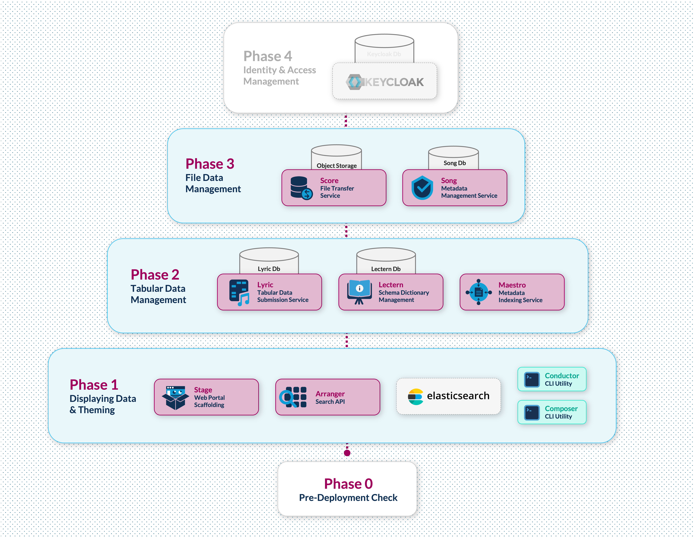

# Prelude - Version 1.0.0-beta

Prelude is a toolkit for the planning and development stages of Overture data platform implementation. It helps teams incrementally build and validate platform requirements.

> [!IMPORTANT]
> Prelude is not intended for production environments. It serves as a preparatory tool to ensure successful production deployments.

We welcome feedback and suggestions—please share them via [our ideas forum](https://github.com/overture-stack/docs/discussions/new?category=ideas).

## Development Phases

Prelude is structured into four incremental phases:



| **Phase**                               | **Focus**                           | **Components**                    |
| --------------------------------------- | ----------------------------------- | --------------------------------- |
| **Phase 0:** Pre-Deployment Check       | Making sure you have all the required prerequisites | Docker, appropriate resources for docker & Node |
| **Phase 1:** Data Exploration & Theming | Data visualization in the portal    | Elasticsearch, Arranger, Stage    |
| **Phase 2:** Tabular Data Management    | Backend data storage and validation | Lyric, Lectern, Postgres, MongoDB |
| **Phase 3:** File Management            | File storage and metadata tracking  | Song, Score, Object Storage       |
| **_Phase 4:_** Identity & Access        | Security and user management        | Keycloak integration              |

**Phase 4** will be implemented in a future release.

## Supplemental Tools

### Composer

Transforms your data (CSV or JSON) into base Overture configurations including Elasticsearch Mappings, Arranger UI Configs, Lectern Dictionary and Schema, Song Schema. This utility greatly reduces tedious manual configurations.

Depending on the command Composer can input CSV or JSON file(s) that represent your data and output the following:

| Output                            | Purpose                                                              |
| --------------------------------- | -------------------------------------------------------------------- |
| **Elasticsearch Mappings**        | Defines the structure and indexing settings for your data            |
| **Arranger UI Configs**           | Configures the user interface for data exploration and visualization |
| **Lectern Dictionary and Schema** | Creates data dictionaries and schemas for tabular data               |
| **Song Schema**                   | Generates schema configurations for file metadata                    |

### Conductor

Conductor runs the automated deployments from the `/apps/conductor/scripts` directory. It can also be run as a command line client made to streamline interactions with various Overture API endpoints.

As summary of command line client interactions is provided in the table below:

| Feature                      | Description                                                                                                |
| ---------------------------- | ---------------------------------------------------------------------------------------------------------- |
| **CSV to Elasticsearch ETL** | Validate, transform and load CSV data to a specified elasticsearch index.                                  |
| **Configuration Management** | Submit dictionaries to Lectern, Register Lectern dictionaries with Lyric, Update Song Schema and study Ids |
| **Data Management**          | Upload tabular data to Lyric, Upload and publish file data and metadata.                                   |

## Getting Started

You will need:

- **Docker Desktop 4.39.0+** with:
  - 8-core CPU minimum
  - 8 GB memory
  - 2 GB swap
  - 64 GB virtual disk
- **Node.js 20.18.1+ and npm 9+**
- **Linux/macOS environment**

> [!NOTE]
> **Windows Users:** Please use WSL2 with a Bash terminal for all commands in this documentation. Prelude is not supported on native Windows environments.

Run the pre-deployment check to verify your environment:

```bash
make phase0
```

The CLI will provide you with instructions on next steps.

### Deployment specific Make Commands

| Phase                 | Description                      | Command          |
| --------------------- | -------------------------------- | ---------------- |
| **Phase 0**           | Pre-Deployment Check             | `make phase0`    |
| **Phase 1**           | Data Exploration & Theming       | `make phase1`    |
| **Phase 2**           | Tabular Data Management          | `make phase2`    |
| **Phase 3**           | File Management                  | `make phase3`    |
| **Stage Dev**         | Run Stage in development mode    | `make stage-dev` |
| **Reset**             | Reset all containers and volumes | `make reset`     |

## Accessing the Portal

Once running, you can access the portal at: [http://localhost:3000](http://localhost:3000)

The documentation found on the portal and within the `/docs` folder is organized into phases matching the Prelude development workflow:

- **Introduction**: Overview of the Prelude toolkit and its components
- **Phase One**: Data Exploration & Theming (Elasticsearch, Arranger, Stage)
- **Phase Two**: Tabular Data Management (Lyric, Lectern, Postgres, MongoDB)
- **Phase Three**: File Management (Song, Score, Object Storage)
- **Phase Four**: Identity & Access (Coming in future release)
- **Support**: How to get help and contribute

## Development

### Local Development Environment

To modify the documentation portal itself:

1. Clone the repository
2. Install dependencies:
   ```bash
   cd apps/stage
   npm install
   ```
3. Run the development server:
   ```bash
   npm run dev
   ```

### Updating Documentation Content

Documentation content is stored as Markdown files in the `public/docs` directory. To add or update content:

1. Files are prefixed with numbers (`00-`, `01-`, etc.) to control ordering
2. Each file should start with a top-level heading (`# Title`)
3. Place images in `public/docs/images/`
4. Use standard Markdown syntax for formatting

## Project Structure

The project follows a modular structure with two main applications: Conductor (for data management) and Stage (for the front-end portal).

```
├── apps/
│   ├── composer/                 # Config generation tool
│   │   └── src/                  # Source code
│   │       ├── cli/              # CLI interface
│   │       ├── commands/         # Command implementations
│   │       ├── services/         # Core functions for config generation
│   │       └── utils/            # Utility functions
│   │
│   ├── conductor/                # Data management tool
│   │   ├── src/                  # Source code
│   │   │   ├── cli/              # CLI interface
│   │   │   ├── commands/         # Command implementations
│   │   │   ├── services/         # Core services (ES, Lectern, etc.)
│   │   │   └── utils/            # Utility functions
│   │   ├── configs/              # Configuration files
│   │   │   ├── arrangerConfigs/  # Arranger UI configurations
│   │   │   ├── elasticsearchConfigs/ # Elasticsearch mappings
│   │   │   ├── lecternDictionaries/ # Data dictionaries
│   │   │   └── songSchemas/      # Song schemas
│   │   └── scripts/              # Deployment and service scripts
│   │       ├── deployments/      # Phase deployment scripts
│   │       └── services/         # Service management scripts
│   │
│   └── stage/                    # Frontend portal
│       ├── components/
│       │   ├── pages/            # Page-specific components
│       │   └── theme/            # Theming
│       ├── pages/                # Next.js pages
│       └── public/               # Static assets
│           └── docs/             # Markdown documentation files
│               └── images/       # Documentation images
│
├── configs/                      # Symlink to conductor configs
├── data/                         # Data files
└── docs/                         # Symlink to Stage docs
```

## Windows Support

Prelude is designed to run in Linux/macOS environments. Windows users should:

1. Install [WSL2 (Windows Subsystem for Linux)](https://learn.microsoft.com/en-us/windows/wsl/install)
2. Use Ubuntu or another Linux distribution within WSL2
3. Run all Prelude commands from the Bash terminal in your WSL2 environment
4. Install Docker Desktop with WSL2 integration enabled

WSL2 provides a full Linux kernel and compatibility layer, allowing you to run Prelude's Linux commands without modification.

## Support

For assistance, reach out via the [community support channels](https://docs.overture.bio/community/support), for private inquiries email us at [contact@overture.bio](mailto:contact@overture.bio).
