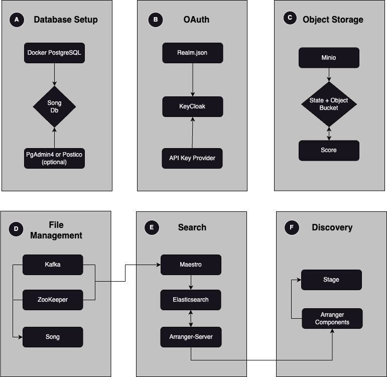

# Overture Composer

> [!NOTE]
> **This repository is under development:** The Overture Composer is currently in the development phase and not yet available for public usage. 

## Rational

With Overture we want to provide new users the following:

|Purpose|Solution|
|---|---|
| **A way to look at it**|[Overture Demo Portal](https://demo.overture.bio/)|
| **A way to try it**| Overture Composer |
| **A way to own it**| [Product Documentation](https://www.overture.bio/documentation/) *and* [Platform Guides](https://github.com/overture-stack/website/pull/385)|


The Overture Composer project aims to provide users interested in gaining hands-on experience using Overture services a fast and frictionless local installation. 

The Overture Composer will also be foundational for our training guides, tutorials, and workshops.

## General Requirements

1. Spin up an Overture platform using docker compose

```bash
git clone https://github.com/overture-stack/overtureComposer \
docker compose up -d 
```

2. Provide a method to seed mock data from our demo portal *(make target used only as example)*

```bash
make seed-data
```

As a general rule if it's in the demo environment, it should be in the quickstart and vice versa. 

- The Composer **will not include**:
    - **Visualization tools:** Further development required
    - **Single Sign on identity providers**: We cannot automate SSI integration (e.g., Google). It must be done through the Google Cloud Console. 

- The Composer **will include**:
    - **An option to seed mock data from the demo portal**: The option to seed one standard data model and data set greatly reduces installation burden. 

## Implementation Overview

Implementation is split into six segments:


 
<br></br>

The following table outlines the requirements in more detail:
| Requirement | Notes |
|---|---|
| A. Database Setup (Postgres)         | Spin up dependent postgres databases with optional PgAdmin4. |                                                                                      
| B. Object Storage (MinIO)   | Set up the object storage provider with a state and object bucket. A minio-data folder will be included in the root directory to store file data locally.  |                                                                                      
| C. OAuth (KeyCloak)  |  To minimize required configuration, import a pre-configured Realm.json and the API Key Provider.  |                                                                                      
| D. File Management (Song, Score, Kafka, ZooKeeper)   | Scores data will be already stored within the minio-data folder, the matching metadata will need to be seeded into Songs Db. |                                                                                      
| E. Search (Elasticsearch, Maestro & Arranger-server) | Start Elasticsearch first, create index with mapping, then start arranger with matching configs |
| F. Discovery (Stage, Arranger Components) | Replicate Stage image from demo portal. Keep this image specific to the Composer.|                                    


