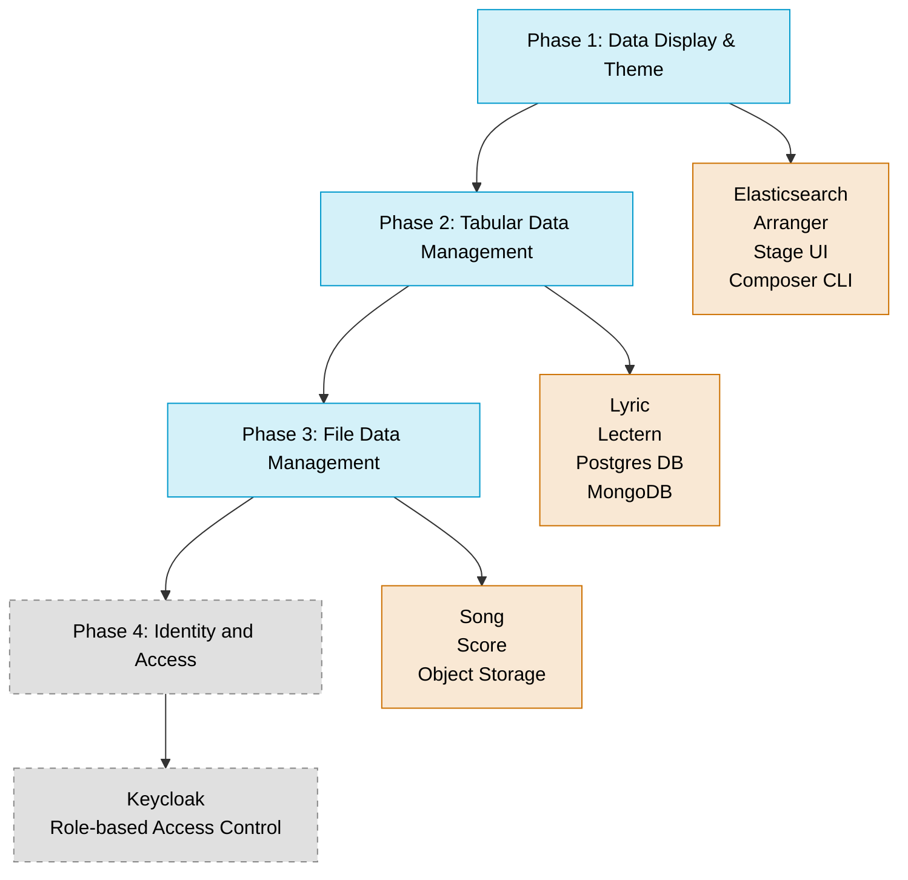

# Introduction

Prelude is a comprehensive toolkit designed for the **planning and development stages** of data platform implementation. It enables teams to build and validate their data platform requirements incrementally before moving to production. By breaking down data portal development into phased steps, teams can systematically verify requirements and user workflows while minimizing technical overhead during the crucial planning and prototype phases.

## Core Benefits

- **Validate requirements** through hands-on testing before production commitment
- **Gain clear understanding** of user workflows and data interactions
- **Document and standardize** data management processes
- **Define granular security** and access control requirements
- **Build a solid foundation** for production deployment planning
- **Ensure data integrity** through structured validation workflows
- **Reduce risk** by confirming platform fit before full production investment
- **Accelerate development** with pre-configured components and guided setup

## Architecture Overview

Prelude implements a phased architecture that grows with your project needs:



## Development Phases

| Phase                                   | Focus                                    | Components                        | Capabilities                                          |
| --------------------------------------- | ---------------------------------------- | --------------------------------- | ----------------------------------------------------- |
| **Phase 1:** Data Exploration & Theming | How your data is displayed in the portal | Elasticsearch, Arranger, Stage    | Display tabular data with search and filters          |
| **Phase 2:** Tabular Data Management    | Back-end data storage and validation     | Lyric, Lectern, Postgres, MongoDB | Schema validation, data submission, quality control   |
| **Phase 3:** File Management            | File storage and metadata tracking       | Song, Score, Object Storage       | Multi-part uploads, file versioning, metadata linking |
| **\*Phase 4:** Identity & Access        | Security and user management             | Keycloak integration              | Authentication, authorization, audit logging          |

**\*Phase 4**, will not be included in the Prelude version 1 release, phase 4 will be implemented following this initial relase.

## Core Tools

### Composer CLI

The **Composer** tool transforms your data into base Overture configurations:

- **Elasticsearch Configuration**: Build ES mappings with automatic type inference
- **Arranger UI Configuration**: Create Arranger configurations for search interfaces
- **Data Dictionary Generation**: Create Lectern dictionaries from CSV data files
- **Schema Creation**: Generate Song schemas from JSON metadata templates

### Conductor CLI

The **Conductor** tool provides workflow management commands simplifying interactions with our APIs across all components:

- **Elasticsearch Management**: Upload CSV data, manage indices and templates
- **Schema Management**: Upload and validate data dictionaries via Lectern
- **Data Validation**: Register dictionaries with Lyric and validate data against schemas
- **File Management**: Upload, manifest, and publish files with Song and Score
- **Study Management**: Create and manage studies and their associated data within Song

## Getting Started

### 1. Prerequisites

- Docker Desktop 4.39.0+ with sufficient resources:
  - 8 cores CPU minimum
  - 8 GB memory
  - 2 GB swap
  - 64 GB virtual disk
- Node.js 18+ and npm 9+

### 2. Installation

```bash
# Clone the repository
git clone -b prelude https://github.com/overture-stack/conductor.git
cd conductor

# Build the Stage image
cd apps/stage
docker build -t stageimage:1.0 .
cd ../..
```

### 3. Launch the Platform

Choose the appropriate phase for your development needs:

```bash
# For Phase 1 (data exploration)
make phase1

# For Stage development
make stage-dev

# For other phases (when ready)
make phase2
make phase3
```

### 4. Access the Portal

After startup, access the portal at: http://localhost:3000

## Common Workflows

## Prelude in the Platform Adoption Journey

Prelude focuses specifically on the **Planning** and **Development** stages of platform adoption:

### Planning Stage

### Development Stage

- **Data Integration**: Connect your data sources to the platform
- **Schema Development**: Define and validate data dictionaries and schemas
- **UI/UX Customization**: Adjust the user interface to your specific needs
- **Workflow Testing**: Verify end-to-end data workflows function as expected

### Bridge to Production (Post-Prelude)

Note that Prelude is **not a production environment**, but prepares you for production by:

- Providing validated configurations that can be transferred to production deployments
- Documenting the specific components and configurations needed for your use case
- Defining resource requirements based on your actual data volumes
- Creating a blueprint for your production security and access control needs

## Support

If you have any questions, please reach out through our [relevant community support channels](https://docs.overture.bio/community/support).

- For public support, use GitHub issues
- For private inquiries, contact OICR Slack or contact@overture.bio

### Common Issues

| Issue | Possible Cause | Solution |
| ----- | -------------- | -------- |
| TBD   | TBD            | TBD      |
