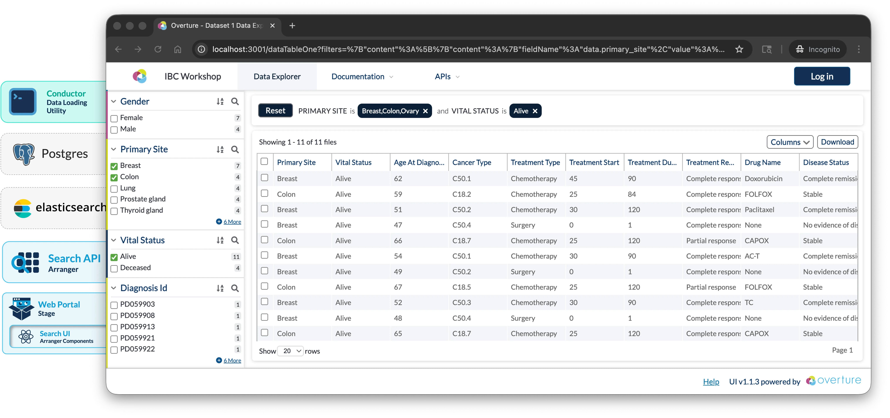

# Intro

:::info
This is our documentation component, if you're reading this here, you've likely already completed the prerequisites below and can skim through them.
:::

This workshop guides you through building a foundational data discovery portal for tabular CSV data using Elasticsearch, Arranger, and Stage.



**Objectives:**

1. Deploy a functional data discovery portal using Elasticsearch, GraphQL, Arranger, and Stage
2. Configure search interfaces and indices tailored to tabular datasets
3. Gain familiarity with the tools needed to adapt this portal to your own data
4. Understand deployment options for making portals accessible on institutional networks and beyond

## Prerequisites

The following software should be installed and verified before the workshop:

<details>
<summary><strong>1. Git</strong> `git --version` returns a version number</summary>

Download from [git-scm.com](https://git-scm.com/downloads) if the command is not recognised.

</details>

<details>
<summary><strong>2. Docker Desktop</strong> (`28.0.0` or later)</summary>

- **macOS / Windows:** Download from [docker.com/products/docker-desktop](https://www.docker.com/products/docker-desktop/)
- **Linux:** Follow the [Docker Engine install guide](https://docs.docker.com/engine/install/)

Once installed, open Docker Desktop → Settings → Resources and set:

- **CPUs:** 4+ cores (8 recommended)
- **Memory:** 8 GB minimum
- **Disk:** 10 GB+ available

Please ensure `docker --version` and `docker compose version` both return version numbers, and Docker Desktop is **running** with **4+ CPUs** and **8 GB+ memory** allocated

</details>

<details>
<summary><strong>3. Docker images pre-downloaded</strong> Most time-consuming step, run these before the workshop</summary>

Pull the required Docker images now to avoid slow downloads during the workshop:

```bash
docker pull alpine/curl:8.8.0
docker pull postgres:15-alpine
docker pull docker.elastic.co/elasticsearch/elasticsearch:7.17.27
docker pull ghcr.io/overture-stack/arranger-server:4919f736
docker pull ghcr.io/overture-stack/conductor:171d9ce
docker pull node:18-alpine
```

Verify all six downloaded:

```bash
docker images | grep -E "alpine/curl|postgres|elasticsearch|arranger-server|conductor|node"
```

You should see all six images listed.

</details>

<details>
<summary><strong>4. Repository cloned:</strong> `git clone -b docs-demo/search-portal-workshop https://github.com/overture-stack/prelude.git`</summary>

The `prelude` repository contains everything needed for this workshop: Docker Compose configuration, the Conductor wrapper script, and sample data. Clone it once before the workshop and you won't need internet access for the hands-on portion.

```bash
git clone -b docs-demo/search-portal-workshop https://github.com/overture-stack/prelude.git
```

</details>

<details>
<summary><strong>5. _(Windows only)_ WSL2 configured</strong> with Docker Desktop integration enabled</summary>

1. Install [WSL2](https://learn.microsoft.com/en-us/windows/wsl/install)
2. Use Ubuntu or another Linux distribution within WSL2
3. Enable Docker Desktop's WSL2 integration (Docker Desktop → Settings → Resources → WSL Integration)
4. Run all workshop commands from a **Bash terminal inside WSL2**, not PowerShell or Command Prompt. To open one, search for your Linux distribution (e.g. "Ubuntu") in the Start menu.

</details>

#### Optional Prerequisites

These are not required but will make the workshop easier to follow:

<details>
<summary><strong>6. (Optional) Elasticvue:</strong>browser-based Elasticsearch GUI</summary>

[Elasticvue](https://elasticvue.com/installation) is a browser-based Elasticsearch GUI useful for inspecting indices, browsing documents, and troubleshooting. It is not required but helpful for understanding what's happening inside Elasticsearch during the workshop.

Install it as a browser extension or standalone app.

</details>

<details>
<summary><strong>7. (Optional) PostgreSQL GUI client</strong></summary>

A PostgreSQL GUI client is useful for browsing the database during the workshop. It is not required but helpful if you want to inspect the Postgres data directly.

| OS      | Recommended client                        |
| ------- | ----------------------------------------- |
| macOS   | [Postico](https://eggerapps.at/postico2/) |
| Windows | [pgAdmin](https://www.pgadmin.org/)       |
| Linux   | [pgAdmin](https://www.pgadmin.org/)       |

</details>

<details>
<summary><strong>8. (Optional) Bring your own data:</strong> CSV file</summary>

If you have a tabular dataset you'd like to use during or after the workshop, bring it as a CSV file. During the workshop we will use demo data, but the final section covers adapting the portal to your own dataset.

</details>

## Support

|                 |                                                                                                                                  |
| --------------- | -------------------------------------------------------------------------------------------------------------------------------- |
| **Questions**   | [community support channels](https://docs.overture.bio/community/support) or [contact@overture.bio](mailto:contact@overture.bio) |
| **Bug reports** | [GitHub Issues](https://github.com/overture-stack/prelude/issues)                                                                |

## Verification Checklist

Before the workshop, confirm:

1. `git --version` returns a version number
2. `docker --version` returns 28.0.0 or later
3. `docker compose version` returns a version number
4. Docker Desktop is running with 4+ CPUs and 8 GB+ memory allocated
5. **All six Docker images are downloaded** (`docker images`) — _this is the most time-consuming step, do it before the day_
6. The repository is cloned and you can `cd` into it
7. _(Windows only)_ WSL2 is configured and Docker integration is enabled

> **Troubleshooting:** If you run into issues, reach out via the [community support channels](https://docs.overture.bio/community/support) or [contact@overture.bio](mailto:contact@overture.bio).
