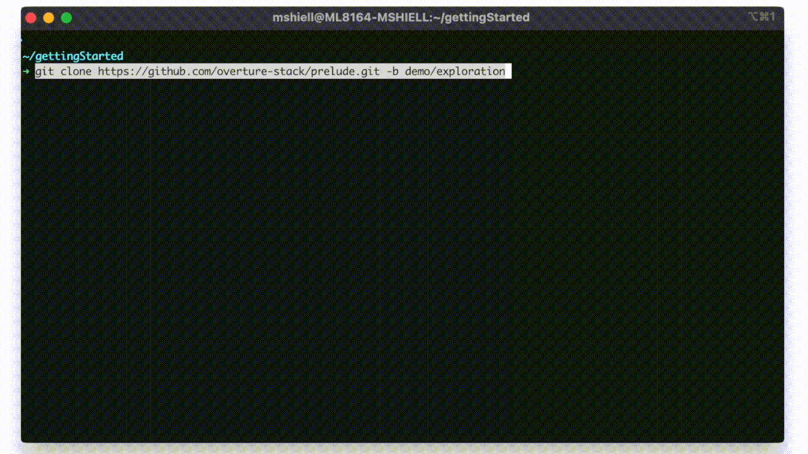
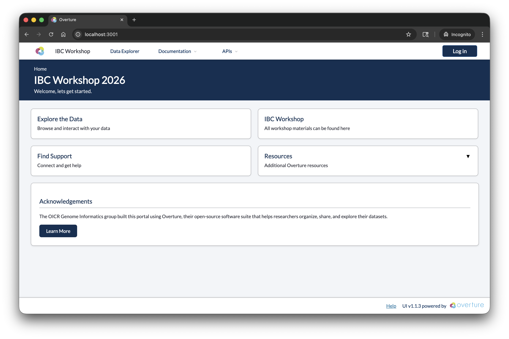
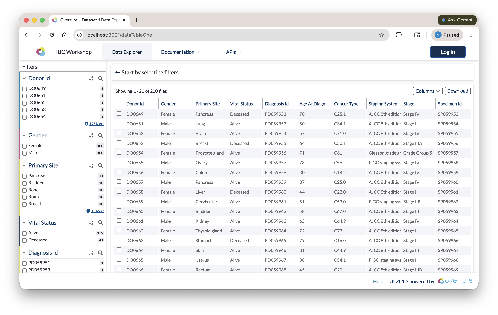
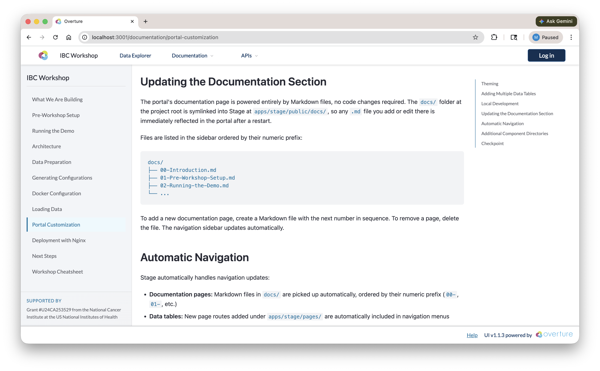

# Running the Demo

Before building anything from scratch, let's deploy the pre-configured demo portal and see what the end result looks like. This gives you a mental model of what each component does before we dive into configuration details.



If you have not done so yet clone the following repository.

```
git clone https://github.com/overture-stack/prelude.git
cd prelude
```

From the root of the cloned repository, run:

```bash
make demo
```

<details>
<summary><strong>Running on Windows?</strong></summary>

| Platform           | Command                             |
| ------------------ | ----------------------------------- |
| WSL2 (recommended) | `make demo` (in an Ubuntu terminal) |
| Native PowerShell  | `.\run.ps1 demo`                    |

**One-time setup for native PowerShell:** allow local scripts to run by executing this once:

```powershell
Set-ExecutionPolicy -ExecutionPolicy RemoteSigned -Scope CurrentUser
```

</details>

The portal will be available at **http://localhost:3000** once deployment completes.

<details>
<summary><strong>What this command does</strong></summary>

1. Runs system checks (Docker version, available resources)
2. Builds the Stage frontend image
3. Starts all services via Docker Compose
4. Initializes PostgreSQL schemas
5. Creates Elasticsearch indices from the pre-configured mappings
6. Loads demo data (clinical/oncology CSV) into Elasticsearch
7. Starts Arranger (search API) and Stage (portal UI)
8. Opens the portal in your browser automatically

</details>

:::info
The first run takes longer because Docker needs to build the Stage image. Subsequent runs will be faster.
:::

### Exploring the Portal

Once the portal loads, take a few minutes to explore:

#### Home Page

The landing page provides an overview and navigation to available data tables. Note the navigation bar, branding, and layout, all of which are configurable.



#### Data Exploration Page

Navigate to the data exploration page from the top navigation. This is where Arranger's components are at work:



- **Facet Panel (left sidebar):** Filter data by clicking on field values. Each facet corresponds to a field in the Elasticsearch index. The fields shown, their order, and their display names are all controlled by Arranger configuration files.

- **Data Table (main area):** Browse records with sortable columns. Which columns are visible, their display names, and whether they're sortable are controlled by Arranger's table configuration.

- **Search and Filtering:** Apply multiple filters across facets. Notice how the result count updates in real time. This is Elasticsearch handling the queries through Arranger's GraphQL API.

- **Export:** If enabled, you can download filtered results as a TSV/CSV file.

#### Documentation Pages

The portal includes built-in documentation pages rendered from markdown files in the `docs/` directory. The content you are reading right now may be served through this same mechanism.



### What's Running

You can verify all services are running:

```bash
docker ps
```

You should see containers for:

| Container             | Port | Role                      |
| --------------------- | ---- | ------------------------- |
| `stage`               | 3000 | Portal frontend           |
| `arranger-datatable1` | 5050 | Search API for datatable1 |
| `elasticsearch`       | 9200 | Search engine             |
| `postgres`            | 5435 | Persistent storage        |

#### Checking Elasticsearch

List all indices to confirm data was loaded:

```bash
curl -u elastic:myelasticpassword http://localhost:9200/_cat/indices?v
```

You should see `datatable1-index` and an Arranger set index. To inspect a sample document:

```bash
curl -u elastic:myelasticpassword "http://localhost:9200/datatable1_centric/_search?pretty&size=1"
```

If you installed Elasticvue, connect to `http://localhost:9200` with credentials `elastic` / `myelasticpassword` to browse indices and documents visually.

#### Checking PostgreSQL

Connect to the database to confirm records were loaded:

```bash
docker exec -it postgres psql -U admin -d overtureDb -c "SELECT COUNT(*) FROM datatable1;"
```

To preview the first few rows:

```bash
docker exec -it postgres psql -U admin -d overtureDb -c "SELECT donor_id, cancer_type, stage FROM datatable1 LIMIT 5;"
```

If you installed Postico or pgAdmin, connect with:

| Setting  | Value        |
| -------- | ------------ |
| Host     | `localhost`  |
| Port     | `5435`       |
| Database | `overtureDb` |
| User     | `admin`      |
| Password | `admin123`   |

#### Checking Arranger GraphQL

Arranger exposes a GraphQL API at `http://localhost:5050/graphql`. You can query it directly to confirm it is serving your data:

```bash
curl -X POST http://localhost:5050/graphql \
  -H "Content-Type: application/json" \
  -d '{"query": "{ datatable1 { hits { total } } }"}'
```

This should return the total number of indexed records. You can also open `http://localhost:5050/graphql` in a browser to access the GraphQL playground and explore the schema interactively.

### Checkpoint

Before moving on, confirm:

1. The portal is running at http://localhost:3000
2. You can see the data exploration page with records in the table
3. Clicking a facet value filters the table results
4. `docker ps` shows containers for `stage`, `arranger-datatable1`, `elasticsearch`, and `postgres`

:::info
**Stuck?** Run `docker logs setup` to see where initialization may have failed. Common issues: Docker not running, port 3000 already in use, insufficient memory allocated to Docker.
:::

### Stopping the Demo

We'll keep the demo running as a reference while we walk through the architecture. When your ready to remove it run:

```bash
make reset
```

:::tip Windows (PowerShell)

```powershell
.\run.ps1 reset
```

:::

**Next:** Now that you've seen the working portal, let's understand how the pieces fit together.
