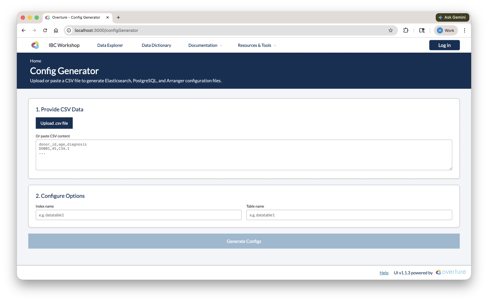
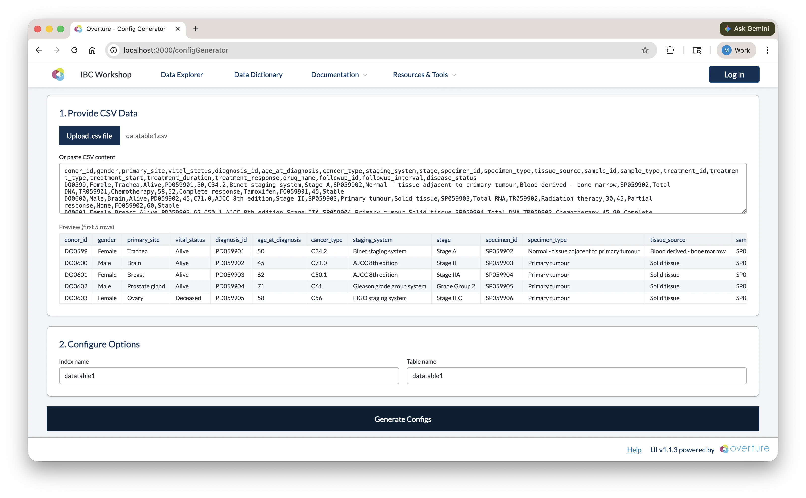
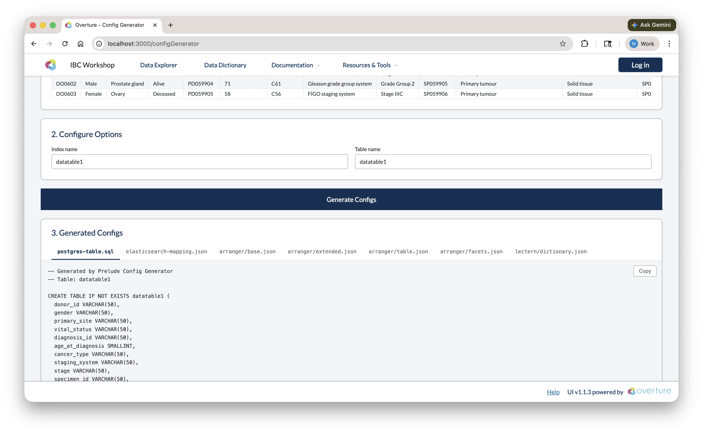

# Generating Configurations

Instead of writing PostgreSQL schemas, Elasticsearch mappings, and Arranger configs by hand, the Stage portal includes a Config Generator that produces all configuration files from your CSV data in one step.

Navigate to **Config Generator** in the Stage portal navigation bar (visible once Stage is running).



### Step 1: Provide CSV Data

Upload a `.csv` file using the **Upload .csv file** button, or paste CSV content directly into the text area. Once loaded, a preview of the first five rows is shown so you can confirm the correct file was used.



### Step 2: Configure Options

| Field          | Description                                                                                                    |
| -------------- | -------------------------------------------------------------------------------------------------------------- |
| **Index name** | The name of the Elasticsearch index. Auto-populated from the CSV filename; edit if needed (e.g. `datatable1`). |
| **Table name** | The name of the PostgreSQL table. Defaults to the same value as the index name.                                |

### Step 3: Generate and Copy

Click **Generate Configs**. Once complete, the output panel shows a tabbed view with seven files:

| Tab                          | File                               | Where to save                                |
| ---------------------------- | ---------------------------------- | -------------------------------------------- |
| `postgres-table.sql`         | `CREATE TABLE` statement           | `setup/configs/postgresConfigs/`             |
| `elasticsearch-mapping.json` | Index template and field mappings  | `setup/configs/elasticsearchConfigs/`        |
| `arranger/base.json`         | Arranger index and document type   | `setup/configs/arrangerConfigs/<indexName>/` |
| `arranger/extended.json`     | Human-readable field display names | `setup/configs/arrangerConfigs/<indexName>/` |
| `arranger/table.json`        | Data table column configuration    | `setup/configs/arrangerConfigs/<indexName>/` |
| `arranger/facets.json`       | Sidebar filter configuration       | `setup/configs/arrangerConfigs/<indexName>/` |
| `lectern/dictionary.json`    | Lectern data dictionary            | `setup/configs/lecternDictionary/`           |

Use the **Copy** button on each tab to copy the content, then paste it into the corresponding file in your project.



### Reviewing the Output

The generated configs are a starting point; review each file before saving and adjust as needed:

#### postgres-table.sql

The generator infers SQL column types from your data (e.g. `VARCHAR` for text, `SMALLINT` or `INTEGER` for numbers) and adds a `submission_metadata JSONB` column for tracking. You may want to:

- Increase `VARCHAR` lengths for columns with longer values
- Change `SMALLINT` to `INTEGER` for larger numeric ranges
- Add constraints if needed (e.g. `NOT NULL`)

<details>
<summary>**Click here to see a breakdown of the generated SQL**</summary>

```sql showLineNumbers
-- PostgreSQL table creation script
-- Generated from CSV analysis
-- Table: datatable1
-- Columns: 24 (23 data + 1 submission_metadata)

CREATE TABLE IF NOT EXISTS datatable1 (
  donor_id VARCHAR(50),
  gender VARCHAR(50),
  primary_site VARCHAR(50),
  vital_status VARCHAR(50),
  diagnosis_id VARCHAR(50),
  age_at_diagnosis SMALLINT,
  cancer_type VARCHAR(50),
  staging_system VARCHAR(50),
  stage VARCHAR(50),
  specimen_id VARCHAR(50),
  specimen_type VARCHAR(63),
  tissue_source VARCHAR(50),
  sample_id VARCHAR(50),
  sample_type VARCHAR(50),
  treatment_id VARCHAR(50),
  treatment_type VARCHAR(50),
  treatment_start SMALLINT,
  treatment_duration SMALLINT,
  treatment_response VARCHAR(50),
  drug_name VARCHAR(50),
  followup_id VARCHAR(50),
  followup_interval SMALLINT,
  disease_status VARCHAR(50),
  submission_metadata JSONB
);

-- Unique index on submission_id within the JSONB metadata column.
-- Required by Conductor's ON CONFLICT deduplication: if a row with the same
-- submission_id is uploaded again, it is silently skipped instead of duplicated.
DROP INDEX IF EXISTS idx_datatable1_submission_id;
CREATE UNIQUE INDEX IF NOT EXISTS idx_datatable1_submission_id
ON datatable1 ((submission_metadata->>'submission_id'));
```

| Element                         | What it means                                                                                                                                                                                                                                |
| ------------------------------- | -------------------------------------------------------------------------------------------------------------------------------------------------------------------------------------------------------------------------------------------- |
| `VARCHAR(50)`                   | A variable-length text field with a max of 50 characters. Increase this if any values in your column are longer, otherwise PostgreSQL will truncate or reject them on insert.                                                                |
| `SMALLINT`                      | A 2-byte integer supporting values from −32,768 to 32,767. Change to `INTEGER` (up to ~2.1 billion) or `BIGINT` if your values can exceed that range.                                                                                        |
| `submission_metadata JSONB`     | A binary JSON column added by the generator and populated by Conductor with each record's tracking info: `submission_id`, `source_file_hash`, and `processed_at`. Do not remove; Conductor depends on it to ensure data is never duplicated. |
| `CREATE TABLE IF NOT EXISTS`    | PostgreSQL skips creation if the table already exists, so it's safe to re-run the script without accidentally dropping data.                                                                                                                 |
| Unique index on `submission_id` | Enforces that each uploaded record has a unique submission ID. If Conductor encounters a duplicate during re-upload, it silently skips the row instead of inserting a duplicate or throwing an error.                                        |

</details>

:::important
The setup service automatically discovers and executes all SQL files in `setup/configs/postgresConfigs/` at startup. Ensure your generated SQL file is saved to this directory before launching the platform.
:::

:::tip
For a full reference on PostgreSQL data types and `CREATE TABLE` syntax, see the [PostgreSQL documentation](https://www.postgresql.org/docs/current/datatype.html).
:::

#### elasticsearch-mapping.json

Field types are inferred from your CSV data. Review and correct:

- Ensure numeric fields are typed as `integer` or `float`, not `keyword`
- Ensure date fields are typed as `date`
- Categorical fields should remain `keyword`

<details>
<summary>**Click here to see a breakdown of the generated mapping**</summary>

```json showLineNumbers
{
  "index_patterns": ["datatable1-*"],
  "aliases": {
    "datatable1_centric": {}
  },
  "mappings": {
    "properties": {
      "data": {
        "type": "object",
        "properties": {
          "donor_id": { "type": "keyword" },
          "gender": { "type": "keyword" },
          "primary_site": { "type": "keyword" },
          "vital_status": { "type": "keyword" },
          "diagnosis_id": { "type": "keyword" },
          "age_at_diagnosis": { "type": "integer" },
          "cancer_type": { "type": "keyword" },
          "staging_system": { "type": "keyword" },
          "stage": { "type": "keyword" },
          "specimen_id": { "type": "keyword" },
          "specimen_type": { "type": "keyword" },
          "tissue_source": { "type": "keyword" },
          "sample_id": { "type": "keyword" },
          "sample_type": { "type": "keyword" },
          "treatment_id": { "type": "keyword" },
          "treatment_type": { "type": "keyword" },
          "treatment_start": { "type": "integer" },
          "treatment_duration": { "type": "integer" },
          "treatment_response": { "type": "keyword" },
          "drug_name": { "type": "keyword" },
          "followup_id": { "type": "keyword" },
          "followup_interval": { "type": "integer" },
          "disease_status": { "type": "keyword" }
        }
      },
      "submission_metadata": {
        "type": "object",
        "properties": {
          "submission_id": { "type": "keyword", "null_value": "No Data" },
          "source_file_hash": { "type": "keyword", "null_value": "No Data" },
          "processed_at": { "type": "date" }
        }
      }
    }
  },
  "settings": {
    "number_of_shards": 1,
    "number_of_replicas": 0
  }
}
```

| Element                            | What it means                                                                                                                                                                    |
| ---------------------------------- | -------------------------------------------------------------------------------------------------------------------------------------------------------------------------------- |
| `index_patterns: ["datatable1-*"]` | This template applies to any index whose name starts with `datatable1-`. Elasticsearch uses it automatically when a matching index is created.                                   |
| `aliases: { datatable1_centric }`  | A stable reference name that Arranger queries. Even if you version your indices, the alias always points to the right one; do not change this without also updating `base.json`. |
| `data` object                      | All your CSV columns are nested here. This separation keeps your data fields distinct from system metadata.                                                                      |
| `keyword` type                     | Exact-match text field, used for categorical values and faceted filtering. Cannot do range queries.                                                                              |
| `integer` type                     | Whole number field, supports range queries and numeric aggregations.                                                                                                             |
| `submission_metadata` object       | Added by the generator, populated by Conductor. Contains `submission_id`, `source_file_hash`, and `processed_at`; do not remove.                                                 |
| `null_value: "No Data"`            | What Elasticsearch displays when a field has no value. Ensures missing data is visible in facets rather than silently absent.                                                    |
| `number_of_shards: 1`              | Number of primary partitions. One is appropriate for local development; increase for multi-node production clusters.                                                             |
| `number_of_replicas: 0`            | Number of copies of each shard. Zero is fine for local dev; set to 1+ in production for redundancy.                                                                              |

</details>

:::info
Date fields can be problematic. Elasticsearch is strict about date formats; if your data contains dates in mixed formats or includes timezone offsets, indexing will fail. It's safest to normalise all date values to ISO 8601 format (`YYYY-MM-DD` or `YYYY-MM-DDTHH:mm:ssZ`). If you're unsure, leaving a date field as `keyword` will allow it to index without errors, though you'll lose date-range filtering.
:::

:::tip
For a full reference on Elasticsearch mapping types and settings, see the [Elasticsearch mapping documentation](https://www.elastic.co/guide/en/elasticsearch/reference/7.17/mapping.html).
:::

#### arranger/base.json

<details>
<summary>**Click here to see a breakdown of base.json**</summary>

```json showLineNumbers
{
  "documentType": "records",
  "esIndex": "datatable1-index"
}
```

| Field          | What it means                                                                                                                |
| -------------- | ---------------------------------------------------------------------------------------------------------------------------- |
| `documentType` | Always set to `"records"` by the generator.                                                                                  |
| `esIndex`      | The Elasticsearch index or alias that Arranger queries. Must match the alias defined in your mapping (`datatable1_centric`). |

</details>

:::important
Update `esIndex` to match the **alias** from your Elasticsearch mapping (`datatable1_centric`), not the index name pattern (`datatable1-*`). Arranger queries through the alias so it always points to the correct index.
:::

#### arranger/extended.json

Display names are auto-generated by converting `snake_case` to Title Case. Review and adjust any that don't read well; these are the labels shown to users in the portal UI.

<details>
<summary>**Click here to see a breakdown of extended.json**</summary>

```json showLineNumbers
{
  "extended": [
    {
      "displayName": "Donor Id",
      "fieldName": "data.donor_id"
    },
    {
      "displayName": "Age At Diagnosis",
      "fieldName": "data.age_at_diagnosis"
    },
    {
      "displayName": "Cancer Type",
      "fieldName": "data.cancer_type"
    }
  ]
}
```

| Field         | What it means                                                                                                            |
| ------------- | ------------------------------------------------------------------------------------------------------------------------ |
| `fieldName`   | The full dot-notation path to the field in Elasticsearch (e.g. `data.donor_id`). Must match the mapping exactly.         |
| `displayName` | The label shown to users in the portal UI for this field. Edit these freely; they have no effect on the underlying data. |

</details>

:::tip
For a full reference on `extended.json`, see the [Arranger extended configuration docs](https://docs.overture.bio/docs/core-software/Arranger/usage/arranger-components).
:::

#### arranger/table.json

Consider hiding metadata columns (e.g. `submission_metadata.*`) by setting `"show": false` and `"canChangeShow": false`.

<details>
<summary>**Click here to see a breakdown of table.json**</summary>

```json showLineNumbers
{
  "table": {
    "rowIdFieldName": "submission_metadata.submission_id",
    "columns": [
      {
        "canChangeShow": true,
        "fieldName": "data.donor_id",
        "show": true,
        "sortable": true,
        "jsonPath": "$.data.donor_id",
        "query": "data { donor_id }"
      },
      {
        "canChangeShow": true,
        "fieldName": "data.cancer_type",
        "show": true,
        "sortable": true,
        "jsonPath": "$.data.cancer_type",
        "query": "data { cancer_type }"
      }
    ]
  }
}
```

| Field            | What it means                                                                                              |
| ---------------- | ---------------------------------------------------------------------------------------------------------- |
| `rowIdFieldName` | The field used as a unique row identifier. Defaults to `submission_metadata.submission_id`; do not change. |
| `fieldName`      | Dot-notation path to the field in Elasticsearch. Must match the mapping.                                   |
| `show`           | Whether the column is visible in the table by default.                                                     |
| `canChangeShow`  | Whether users can toggle this column's visibility using the column selector.                               |
| `sortable`       | Whether clicking the column header sorts the table. Disable for high-cardinality text fields.              |
| `jsonPath`       | JSONPath expression used to extract the value from the response. Matches the field structure.              |
| `query`          | The GraphQL sub-selection used to fetch this field. Must reflect the nested structure in your mapping.     |

</details>

:::tip
For a full reference on `table.json`, see the [Arranger table configuration docs](https://docs.overture.bio/docs/core-software/Arranger/usage/arranger-components#table-configuration-tablejson).
:::

#### arranger/facets.json

Remove or deactivate facets that aren't useful for filtering, such as unique ID fields. Reorder entries to put the most important filters at the top.

<details>
<summary>**Click here to see a breakdown of facets.json**</summary>

```json showLineNumbers
{
  "facets": {
    "aggregations": [
      {
        "active": true,
        "fieldName": "data__gender",
        "show": true
      },
      {
        "active": true,
        "fieldName": "data__cancer_type",
        "show": true
      },
      {
        "active": false,
        "fieldName": "data__donor_id",
        "show": false
      }
    ]
  }
}
```

| Field       | What it means                                                                                                                                                                                    |
| ----------- | ------------------------------------------------------------------------------------------------------------------------------------------------------------------------------------------------ |
| `fieldName` | Double-underscore notation for the field path (e.g. `data__cancer_type` for `data.cancer_type`). This is specific to `facets.json` and differs from the dot-notation used in other config files. |
| `active`    | Whether the facet is enabled and will appear in the sidebar.                                                                                                                                     |
| `show`      | Whether the facet is visible by default (can be used alongside `active` to pre-collapse a facet).                                                                                                |

</details>

:::tip
For a full reference on `facets.json`, see the [Arranger facet configuration docs](https://docs.overture.bio/docs/core-software/Arranger/usage/arranger-components#facet-configuration-facetsjson).
:::

### Checkpoint

Before proceeding, confirm:

1. `setup/configs/postgresConfigs/datatable1.sql` exists and contains a CREATE TABLE statement matching your CSV columns
2. `setup/configs/elasticsearchConfigs/datatable1-mapping.json` exists and contains field mappings
3. `setup/configs/arrangerConfigs/datatable1/` contains `base.json`, `extended.json`, `table.json`, and `facets.json`
4. `base.json` has `"esIndex": "datatable1_centric"` (the alias, not the index name)
5. You've made at least one change to `facets.json` (hidden a facet or reordered entries)
6. `setup/configs/lecternDictionary/datatable1.json` exists (if using the Lectern data dictionary)

**Next:** We will learn how `docker-compose.yml` picks up these configuration files and wires them into the running services.
