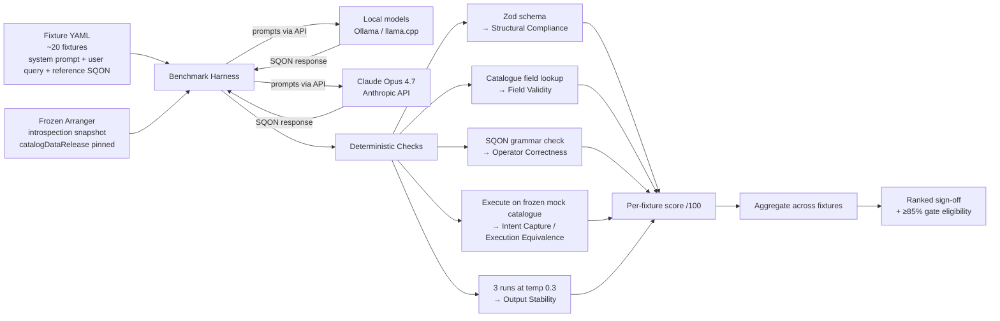

# Model Selection

The goal of model selection is to pick the local model that will be used in the pilot, and to produce a ranked comparison of ~7 candidates for the sign-off baseline. This is a benchmark run against fixtures with deterministic scoring, the model is the only independent variable.

We are adapting a framework set by [Wada et al. (2026)](https://pmc.ncbi.nlm.nih.gov/articles/PMC12894992/) however, scaled down to fit Aim 1 capacity currently we are targeting:

- **7 candidates**, including **6 local open-weight** models and **1 commercial frontier model**
- **~20 fixtures × 1 trial** (sized so the ≥85% gate maps to a 3-miss budget at 17/20)
- **Deterministic scoring** (rather than LLM-as-judge with κ calibration.)

## Candidates

The shortlist is fixed at seven candidates spanning a variety of architectures, sizes, and tool-use specializations, plus one commercial frontier baseline that defines the performance ceiling.

We have split our LLMs into three tiers:

1. A **workstation tier (5 candidates)** that spans paramaeterization range of 15B–31B including both dense and MoE architectures from four publishers (Microsoft, Mistral AI, Alibaba, Google). This lets us say something defensible about whether MoE efficiency matters at consumer hardware and whether tool-use-specialised models (Mistral) outperform general-reasoning models (Qwen, Gemma) on a tool-calling workload.

2. An **institutional tier (1 candidate)**, a single data point representing a larger 70B LLM deployed on an HPC.

3. A **commercial baseline** using Claude Opus 4.7 to define the performance ceiling.

| ID   | Model             | Tier          | Architecture | Params (Q4 VRAM)           | Role                                          | Key Advantage for SQON (Gemini 3 Output)                                                             |
| ---- | ----------------- | ------------- | ------------ | -------------------------- | --------------------------------------------- | ---------------------------------------------------------------------------------------------------- |
| LLM1 | Phi-4-Reasoning   | Workstation   | Dense        | 15B (~10 GB)               | Small/efficient option for 16 GB laptops      | High-density reasoning capability within the tightest VRAM constraints.                              |
| LLM2 | Mistral Small 3.2 | Workstation   | Dense        | 24B (~15 GB)               | Tool-use specialist, relevant to MCP workload | Native tool-use optimization reduces "hallucinated field" errors in SQON outputs.                    |
| LLM3 | Qwen 3.5-27B      | Workstation   | Dense        | 27B (~17 GB)               | Primary pilot favourite                       | Superior performance on multi-step complex logic and nested AND/OR structures.                       |
| LLM4 | Gemma 4 31B       | Workstation   | Dense        | 31B (~20 GB)               | Alternative dense for 24 GB+ workstation      | High baseline stability; requires the fewest Self-Refine iterations to reach accuracy gates.         |
| LLM5 | Gemma 4 26B-A4B   | Workstation   | MoE          | 26B / 3.8B active (~16 GB) | MoE at workstation tier                       | Provides 30B-class reasoning at significantly lower inference latency via active parameter sparsity. |
| LLM6 | Llama 4 Scout     | Institutional | MoE          | 109B / 17B active (~12 GB) | 70B-class data point on institutional server  | Handles massive catalogue schema contexts via dynamic expert loading and 16-expert MoE.              |
| LLM7 | Claude Opus 4.7   | Commercial    | Frontier     | N/A (managed API)          | Performance ceiling baseline                  | Ideally 100% zero-shot accuracy; serves as the gold-standard for execution equivalence fixtures.     |

<details>
<summary>Edge Tier Reserve: mitigation if workstation-tier results suggest a smaller floor is worth probing, or if an edge-deployment target emerges.</summary>

Sub-workstation candidates (≤8B parameters) held as a reserve list. Not currently in the shortlist of 7.

| ID    | Model          | Tier | Architecture | Params (Q4 VRAM) | Key Advantage for SQON / Structured Data                                                                                                        |
| ----- | -------------- | ---- | ------------ | ---------------- | ----------------------------------------------------------------------------------------------------------------------------------------------- |
| LLM8  | Granite 4.1 8B | Edge | Dense        | 8B (~5.5 GB)     | Syntax predictability: avoids long CoT traces to prioritise strict schema adherence; best "zero-jitter" candidate for final SQON serialisation. |
| LLM9  | DeepSeek R1 8B | Edge | Distilled    | 8B (~5.2 GB)     | Logic debugging: distilled self-verification can explain _why_ a nested AND/OR structure is invalid via `<think>` traces.                       |
| LLM10 | Phi-4-Mini     | Edge | Dense        | 3.8B (~2.8 GB)   | Local autocomplete: highest reasoning-per-token density for real-time SQON editor support on CPU/NPU hardware.                                  |
| LLM11 | Gemma 4 E4B    | Edge | PLE Dense    | 4B (~3.1 GB)     | Schema ingestion: Per-Layer Embeddings enable 128K context for mapping massive data dictionaries into concise SQON objects without truncation.  |
| LLM12 | Qwen 3 4B      | Edge | Dense        | 4B (~2.9 GB)     | Logic continuity: best alignment with Qwen 3.5; serves as a "mini-pilot" to test whether logic gates hold before scaling to the 27B variant.    |

</details>

<details>
<summary>Institutional Tier Reserve: mitigation if workstation-tier candidates fail to clear the ≥85% execution-equivalence gate, to test whether the workload is recoverable at greater scale on HPC hardware.</summary>

Larger institutional-tier candidates (>70B parameters) held as a reserve list.

| ID    | Model              | Tier          | Architecture | Params (Active / Total) | Key Advantage for SQON / Structured Data                                                                                                                       |
| ----- | ------------------ | ------------- | ------------ | ----------------------- | -------------------------------------------------------------------------------------------------------------------------------------------------------------- |
| LLM13 | Llama 4 Maverick   | Institutional | MoE          | 17B active / 400B total | Expert granularity: 128 specialised experts (vs. Scout's 16); superior at deep logic specialisation for complex gated structures.                              |
| LLM14 | DeepSeek V3.5 / R1 | Institutional | MoE          | 37B active / 671B total | Semantic recovery: industry benchmark for reasoning-at-scale. If this model fails to interpret intent, the SQON schema likely needs human refactoring.         |
| LLM15 | Qwen 3 235B        | Institutional | MoE          | 22B active / 235B total | Publisher parity: eliminates training-recipe bias when verifying logic generated by the primary pilot candidate (Qwen 3.5-27B).                                |
| LLM16 | Mistral Large 3    | Institutional | Dense        | ~123B dense             | Structural integrity: large dense architecture lacks MoE routing noise; ideal for verifying whether expert-switching is causing logical drift in SQON outputs. |

</details>

## Hardware Envelope

The hardware envelope defines the environment each candidate is evaluated on and, by extension, the realistic ceiling on model capability for that tier. It will also be importatant to clearly define to inform all design decisions throughout Aim 1: it bounds which models are eligible, sets the latency expectations researchers will experience in the pilot, and determines the minimum hardware a user would need to run. The current envelope is provisional and will be refined as we gain new information.

| Tier           | Hardware               | Memory           | Candidates Evaluated                                                                        | Role                                                                                                                                                                                  |
| -------------- | ---------------------- | ---------------- | ------------------------------------------------------------------------------------------- | ------------------------------------------------------------------------------------------------------------------------------------------------------------------------------------- |
| Edge (reserve) | CPU / NPU / ≤8 GB GPU  | ≤8 GB            | Granite 4.1 8B, DeepSeek R1 8B, Phi-4-Mini, Gemma 4 E4B, Qwen 3 4B                          | _Mitigation_, activated only if workstation tier suggests a smaller floor is worth probing.                                                                                           |
| Workstation    | Apple M3/M4 Pro or Max | 16–24 GB Unified | Phi-4-Reasoning, Mistral Small 3.2, Qwen 3.5-27B, Gemma 4 31B, Gemma 4 26B-A4B (all Q4_K_M) | **Main focus** the pilot model is selected from this tier.                                                                                                                            |
| Institutional  | HPC (multi-GPU)        | ≥80 GB           | Llama 4 Maverick, DeepSeek V3.5 / R1, Qwen 3 235B, Mistral Large 3                          | We will test one model running on an HPC node for initial comparison. A larger set of LLMs that require more memory to run will be used if workstation teir proves to be insufficien. |
| Managed        | Commercial API         | N/A              | Claude Opus 4.7 (default sampling)                                                          | Baseline, defines the performance ceiling; not a deployment target.                                                                                                                   |

## Screening

Screening runs in four phases. The main way models get cut is by making the tests harder. Because the starting list is already small, a model that fails a phase is excluded from the pilot but still appears in the final ranked comparison.

| Phase                                         | Methodology                                                                                                                                                                                                                                              | Optimization Goal                                                                                                                                                                                                                                                                                                                                                                                                                                                                                                                                                                                                       |
| --------------------------------------------- | -------------------------------------------------------------------------------------------------------------------------------------------------------------------------------------------------------------------------------------------------------- | ----------------------------------------------------------------------------------------------------------------------------------------------------------------------------------------------------------------------------------------------------------------------------------------------------------------------------------------------------------------------------------------------------------------------------------------------------------------------------------------------------------------------------------------------------------------------------------------------------------------------- |
| 1. Baseline Screening                         | Zero-shot prompts built from the a saved set of Arranger introspection data (injected as prompt context; no live API calls). These will have an expected output, specifically records retrieved. This will comprise of ~20 fixtures × 1 trial per model. | Establish raw deterministic-score baseline.                                                                                                                                                                                                                                                                                                                                                                                                                                                                                                                                                                             |
| 2. Capacity-Matched Prompting                 | Chain-of-Thought + Few-Shot examples for models scoring above Q1 (first qaurtile); simplified format-focused prompts for models below Q1.                                                                                                                | Determine which models have reasoning depth for multi-step SQON logic; whether simpler prompts close the format-compliance gap for weaker models.                                                                                                                                                                                                                                                                                                                                                                                                                                                                       |
| 3. Execution Equivalence & Latency            | Run each candidate on its target tier. Measure execution-equivalence against the Commercial baseline and latency per query.                                                                                                                              | Produce the Phase 3 execution-equivalence number per candidate; any failure feeds Phase 4 for single-pass Self-Refine. Flag any model with median latency >10 s (soft ceiling — does not exclude from pilot; threshold is provisional pending pilot task-completion data). The ≥85% gate is applied to the _final_ equivalence number after Phase 4 (see below).                                                                                                                                                                                                                                                        |
| 4. Failure Recovery (Single-Pass Self-Refine) | Single-pass Self-Refine on Phase 3 failures: model is shown the reference SQON plus a one-sentence error explanation, then re-prompted.                                                                                                                  | Before Self-Refine is applied, classify each failure by type: **structural** (invalid SQON), **semantic-field** (valid field, wrong one for the query), **semantic-value** (correct field, wrong threshold or value), or **semantic-scope** (correct field and value, wrong operator combination). Self-Refine is then applied to observe whether failures are recoverable — structural failures typically recover more readily than semantic ones. The post-Phase 4 equivalence is the number compared against the ≥85% gate; the recovery profile (which failure types recover after one pass) is reported alongside. |

The **≥85% execution-equivalence gate** against the Commercial baseline (Claude Opus 4.7) is applied to the _final_ equivalence number — i.e., after single-pass Self-Refine has been applied to Phase 3 failures. Any local model that fails to clear the gate on the Workstation tier is not eligible for the pilot but remains in the full ranked sign-off comparison alongside all other candidates. In Aim 1 Self-Refine is limited to one pass; iterative Self-Refine optimization with measured convergence trajectories is deferred to Aim 2.

## Scoring

The 5-metric vocabulary frames what gets checked. In Aim 1 every metric is computed **deterministically** against the catalogue schema or by **execution-equivalence**. There is no LLM-as-judge in the scoring loop.

| Metric                | Weight | Aim 1 Implementation (Deterministic)                                                                                                                                                                                                                                                                                                       |
| --------------------- | ------ | ------------------------------------------------------------------------------------------------------------------------------------------------------------------------------------------------------------------------------------------------------------------------------------------------------------------------------------------ |
| Intent Capture        | 25 pts | Execution-equivalence against the pre-authored reference SQON for that fixture. Computed per-query as exact record-set match. This is the relevance check: a structurally valid SQON that misinterprets the query will produce the wrong record set and fail here regardless of syntactic correctness.                                     |
| Field Validity        | 25 pts | Every `fieldName` checked against `arranger://fields/{catalogId}` for the recorded `catalogDataRelease`. Binary per field.                                                                                                                                                                                                                 |
| Operator Correctness  | 20 pts | Operator must appear in the SQON grammar AND `applicableTo` must include the field type. Schema-checked.                                                                                                                                                                                                                                   |
| Structural Compliance | 20 pts | Final-attempt SQON passes the `@overture-stack/sqon` Zod schema.                                                                                                                                                                                                                                                                           |
| Output Stability      | 10 pts | Record-set drift across 3 identical runs at `temperature=0.3` per fixture; pass if all 3 runs return execution-equivalent record sets. Temp 0 is degenerate (greedy sampling produces σ ≈ 0 by construction, so any variance would be hardware-kernel noise); temp 0.3 stays close to the argmax while exposing real sampling instability. |

<details>
<summary>How the 100-point score is calculated: per-fixture breakdown, aggregation rule, and known properties of the scheme.</summary>

Each fixture is scored independently against the five metrics, then the per-fixture scores are averaged across the ~20-fixture set to produce a single `/100` per model.

For one fixture, the per-metric points are awarded as follows:

- **Intent Capture (25 pts)**: 25 if the generated SQON is execution-equivalent to the reference (exact record-set match); 0 otherwise. Binary.
- **Field Validity (25 pts)**: proportional to valid fields, `25 × (valid fieldNames / total fieldNames)`. A SQON referencing 3 of 4 valid fields scores 18.75.
- **Operator Correctness (20 pts)**: proportional to valid operator-on-field combinations — `20 × (valid operator uses / total operator uses)`.
- **Structural Compliance (20 pts)**: 20 if the final-attempt SQON passes the `@overture-stack/sqon` Zod schema; 0 otherwise. Binary.
- **Output Stability (10 pts)**: 10 if all 3 runs at `temperature=0.3` return execution-equivalent record sets; 0 otherwise. Binary, evaluated once per fixture (not per run).

**Aggregation:** model score = mean(fixture scores). Execution equivalence (the gating metric) is reported separately as the percentage of fixtures with Intent Capture = 25, i.e. it is the binary pass/fail count for Intent Capture across the fixture set, not the weighted score. The ≥85% gate applies to that count, not the `/100` aggregate.

**Two known properties of this scheme** (intentional, but worth documenting):

1. _Metric overlap is by design._ A single invalid field name typically tanks three metrics at once — Field Validity, Intent Capture (no records returned), and often Structural Compliance (Zod rejects unknown fields). The `/100` is therefore not five independent signals; it is dominated by Intent Capture and uses the other metrics as severity multipliers. This is the desired behaviour: catastrophic-but-correctable errors (one wrong field) cost more than localised ones.
2. _Gate and `/100` are decoupled._ A model can clear the ≥85% gate while ranking lower on `/100` (e.g. high execution equivalence but unstable, or with partial field/operator misses on the fixtures it does match). The gate decides pilot eligibility; the `/100` decides ranking among the eligible.

</details>

**Execution equivalence** is the gating metric. It is calculated per-query as exact record-set match (record IDs and counts) between the candidate's generated SQON and the reference SQON, **both executed against the frozen mock-catalogue snapshot** served by a local Arranger instance — not live production Arranger. Aggregated across the fixture set as a percentage. A model must achieve **≥85%** execution equivalence (i.e. at most 3 fixture misses out of ~20) against Claude Opus 4.7 to clear the gate and be eligible for the pilot.

:::note
**Why no LLM-as-judge in Aim 1 scoring:** Validating an LLM-as-judge with κ ≥ 0.90 requires ≥2 trained human reviewers consistently applying the rubric across a calibration sample. Current architect capacity is 0.5; the κ apparatus is deferred to Aim 2. A single-judge sanity check on `confirmationSummary` fidelity is permitted as observation, never as a KPI. See [Regression Testing](./05-Regression-Testing) for the layered evaluator that produces the same outcome without judge dependency.

:::

## Fixtures

The model benchmark runs against **~20 fixtures** derived from real Arranger introspection of the deployed Drug Discovery Portal catalogues, frozen as a versioned static snapshot for reproducibility. The count is sized so the ≥85% gate maps to a 3-fixture-miss budget (17/20), keeping the threshold meaningful rather than collapsing into a near-perfect-score requirement at smaller fixture counts. Models never call the live Arranger API during evaluation; the introspection response is recorded once from the live endpoint, saved as a fixture file tagged with a `catalogDataRelease` identifier, and injected as prompt context for every run. Fixture coverage:

- ~10 single-field filters (one operator class each)
- ~6 multi-field AND/OR queries
- ~3 negation/exclusion queries
- ~1 multi-step complex logic query

Each fixture has one pre-authored reference SQON. Two SQONs that produce the same record set against the frozen catalogue are treated as equivalent regardless of structural difference (operator-equivalent forms are accepted). Equivalence classes for known multi-form fixtures are documented in the fixture YAML.

Several fixtures are intentionally designed as semantic traps: queries where a plausible wrong-field choice or wrong threshold produces a structurally valid SQON that passes all schema checks but returns a different record set. These fixtures are indistinguishable by syntax, only execution equivalence surfaces the failure. They are the primary mechanism for catching models that pattern-match on surface query features rather than understanding researcher intent.

<details>
<summary>YAML Example Fixture: YAML schema and a fully-worked single-field example.</summary>

A single fixture in the YAML file looks like this:

```yaml
- id: mut-002-tumor-suppressor
  category: single-field
  catalog: mutation
  catalogDataRelease: 2026-03-snapshot-v1
  user_query: "Find all mutations in tumor suppressor genes"
  reference_sqon:
    op: in
    content:
      fieldName: data.is_tumor_suppressor_gene
      value: ["true"]
  expected_record_count: 487
  equivalence_classes:
    # Optional: alternative SQON forms that produce the same record set
    - op: filter
      content:
        fieldName: data.is_tumor_suppressor_gene
        value: "true"
  notes: |
    Tests binary keyword lookup. A model that picks `data.is_oncogene`
    instead is a classic semantic-field failure (Phase 4 typology).
```

Fields:

- `id` — stable identifier used in scoring reports.
- `category` — one of `single-field`, `multi-field`, `negation`, `complex-logic`, or `semantic-trap`.
- `catalog` + `catalogDataRelease` — pin the introspection snapshot used to build the system prompt; the harness loads the corresponding snapshot from the static fixture directory.
- `user_query` — the natural-language query passed verbatim to the model.
- `reference_sqon` — pre-authored ground truth. Executed against the frozen mock catalogue to produce `expected_record_count`.
- `equivalence_classes` (optional) — alternative SQON structures that produce the same record set; the harness accepts any of these as a match without execution.
- `notes` (optional) — fixture authorship context; not used by the harness.

</details>

:::note
The model selection fixture set is taken once from the introspection snapshot and is **never updated** during Aim 1 — this is what makes the model the only independent variable. Pinning the fixtures to a single `catalogDataRelease` means a benchmark run six weeks apart on the same model produces the same score. Versioned fixtures that track ongoing catalogue evolution are the job of [Regression Testing](./05-Regression-Testing); the two fixture pools are separate by design (see [Evaluation Plan Key Decision #2](./03-Evaluation-Plan#key-decisions)).
:::

## Dataflow



## End-End Example

:::info
All examples in this section are **hypothetical and illustrative**. No model evaluation has been run yet. The numbers, outputs, and outcomes are constructed to demonstrate the expected form of results for each phase — they are not real benchmark data.
:::

These worked examples cover each of the four screening phases. Each example uses fixtures derived from real Arranger introspection of the mutation, expression, and protein catalogues. Scoring is **deterministic throughout**, schema-grounded checks plus execution equivalence against pre-authored reference SQON. No LLM-as-judge appears in the scoring loop.

<details>
<summary><strong>Phase 1: Baseline Screening (Zero-Shot)</strong></summary>

The goal of Phase 1 is to establish raw deterministic-score baselines for all seven shortlisted candidates without any prompt engineering. Models scoring above the Q1 threshold receive Chain-of-Thought prompts in Phase 2; models below receive simplified format-focused prompts (the Wada-derived capacity-matched split).

:::note
**Prompts and queries are delivered by a benchmark harness, not pasted into a chat UI.** The system-prompt and user-query blocks shown in the examples below are the _content_ of each fixture (stored in the fixture YAML). At run time, a harness iterates over fixtures × candidate models, posts each `{system_prompt, user_query}` pair to the model's inference endpoint (Ollama / llama.cpp server for local models, Anthropic API for Claude Opus 4.7), captures the raw response, and pipes it through the deterministic checks. Hand-pasting into a chat interface would make Output Stability unmeasurable (three identical runs cannot be reproduced manually) and would block reproducibility across the ~420 calls a full sweep requires (7 models × ~20 fixtures × 3 stability runs).
:::

#### Example 1.1: Mutation Catalogue, Simple Single-Field Query

**System prompt** (dynamically constructed from `/introspection/mutation`):

```
You are a data discovery assistant. Your task is to convert the user's natural
language query into a valid SQON filter for the Arranger search API.

Catalog: mutation
Available fields and valid operators:
  data.hugo_symbol                  (keyword) operators: in, not-in, some-not-in, all, filter
  data.cancer_type                  (keyword) operators: in, not-in, some-not-in, all, filter
  data.is_oncogene                  (keyword) operators: in, not-in, some-not-in, all, filter
  data.is_tumor_suppressor_gene     (keyword) operators: in, not-in, some-not-in, all, filter
  data.overall_mutation_frequency   (keyword) operators: in, not-in, some-not-in, all, filter
  data.dataset_name                 (keyword) operators: in, not-in, some-not-in, all, filter

SQON structure:
  Combination operator: { "op": "and" | "or" | "not", "content": [ <sqon>, ... ] }
  Field filter: { "op": "in" | "not-in" | ..., "content": { "fieldName": "...", "value": [...] } }

Output only valid JSON. No explanation. No markdown formatting.
```

**User query:** `"Find all mutations in tumor suppressor genes"`

**Reference SQON:**

```json
{
  "op": "in",
  "content": {
    "fieldName": "data.is_tumor_suppressor_gene",
    "value": ["true"]
  }
}
```

##### Example 1.1a: Qwen 3.5-27B (Q4_K_M) — Pass

```json
{
  "op": "in",
  "content": {
    "fieldName": "data.is_tumor_suppressor_gene",
    "value": ["true"]
  }
}
```

**Deterministic scoring:**

| Metric                | Result | Points | Notes                                                                   |
| --------------------- | ------ | ------ | ----------------------------------------------------------------------- |
| Intent Capture        | Pass   | 25/25  | 487 records, exact record-set match to reference                        |
| Field Validity        | Pass   | 25/25  | `data.is_tumor_suppressor_gene` present in introspection                |
| Operator Correctness  | Pass   | 20/20  | `in` valid for keyword type                                             |
| Structural Compliance | Pass   | 20/20  | Valid SQON per `@overture-stack/sqon` Zod schema                        |
| Output Stability      | Pass   | 10/10  | All 3 runs at `temperature=0.3` return execution-equivalent record sets |

**Phase 1 score: 100/100.** Advances to Phase 2 in the high-performing group.

##### Example 1.1b: Llama 4 Scout (FP8 on A100) — Field Validity Failure

```json
{
  "op": "in",
  "content": {
    "fieldName": "tumor_suppressor",
    "value": "true"
  }
}
```

**Deterministic scoring:**

| Metric                | Result | Points | Notes                                                                               |
| --------------------- | ------ | ------ | ----------------------------------------------------------------------------------- |
| Intent Capture        | Fail   | 0/25   | Query fails schema validation; 0 records returned, no record-set match              |
| Field Validity        | Fail   | 0/25   | `tumor_suppressor` does not exist; correct field is `data.is_tumor_suppressor_gene` |
| Operator Correctness  | Pass   | 20/20  | `in` valid for keyword type (counted on the operator alone, independent of field)   |
| Structural Compliance | Fail   | 0/20   | `value` is a bare string, not an array — fails Zod schema                           |
| Output Stability      | Pass   | 10/10  | Consistent record-set output (empty) across 3 runs at `temperature=0.3`             |

**Phase 1 score: 30/100.** Below Q1 threshold; advances to Phase 2 in the simplified-prompt group. One invalid field cascades into Intent Capture, Field Validity, and Structural Compliance failures simultaneously — an example of the deliberate severity weighting in the 5-metric vocabulary.

:::note
This is the deterministic-scoring approach in action. Every cell in the scoring table is decidable without a judge: structural validity is a Zod check, field existence is a catalogue lookup, operator validity is a grammar check, execution equivalence is a record-set diff. The 5-metric vocabulary frames what is being checked; the implementation is mechanical.
:::

</details>

<details>
<summary><strong>Phase 2: Capacity-Matched Prompting</strong></summary>

Phase 2 splits the shortlist into two groups based on Phase 1 scores and applies prompts matched to capacity. The high-performing group receives Chain-of-Thought prompts with multi-step examples. The lower-performing group receives simplified format-focused prompts. Wada et al.'s key finding is that simplified prompts can unlock format compliance in lower-capacity models even when reasoning depth remains insufficient.

#### Example 2.1: High-Performing Group — Multi-Condition CoT Prompt

The CoT prompt adds explicit step-by-step reasoning instructions and two worked examples before the user query, then asks for SQON only.

**System prompt addition** (excerpt):

```
IMPORTANT: Before generating SQON, think through the query step by step:
1. Identify all conditions the user is asking for
2. Determine the logical operators (AND/OR) between conditions
3. Map each condition to a field in the available schema
4. Construct the SQON structure, combining conditions as needed

Few-Shot Example:
User: "Find mutations in TP53 from lung or breast cancer"
Thought: User wants (TP53 gene) AND (lung OR breast cancer). Top-level op is AND
because the user wants records matching both a specific gene AND one of the two
cancer types.
SQON: { "op": "and", "content": [ ... ] }
```

**User query:** `"Find mutations in BRCA1, BRCA2, or TP53 from breast or ovarian cancer that are tumor suppressors"`

**Reference SQON:**

```json
{
  "op": "and",
  "content": [
    {
      "op": "in",
      "content": {
        "fieldName": "data.hugo_symbol",
        "value": ["BRCA1", "BRCA2", "TP53"]
      }
    },
    {
      "op": "in",
      "content": {
        "fieldName": "data.cancer_type",
        "value": ["Breast Adenocarcinoma", "Ovarian Adenocarcinoma"]
      }
    },
    {
      "op": "in",
      "content": {
        "fieldName": "data.is_tumor_suppressor_gene",
        "value": ["true"]
      }
    }
  ]
}
```

**Qwen 3.5-27B output under CoT prompt** — identical to reference. All Layer 1 checks pass; execution equivalence holds at 212 records.

**Phase 2 score: 100/100** (Output Stability 10/10 — array order varies between runs but record sets are identical across all 3 runs at `temperature=0.3`, so the execution-equivalence-based stability check still passes).

#### Example 2.2: Lower-Performing Group — Simplified Format Prompt

Same query, simpler prompt that omits CoT and emphasises format compliance:

```
Convert natural language to SQON JSON.

Catalog: mutation
Fields: data.hugo_symbol, data.cancer_type, data.is_oncogene,
data.is_tumor_suppressor_gene, data.overall_mutation_frequency, data.dataset_name

SQON format:
Field filter: { "op": "in", "content": { "fieldName": "DATA.FIELD", "value": [...] } }
Combination: { "op": "and", "content": [ ... ] }

Output JSON only. No explanation.
```

**Llama 4 Scout output under simplified prompt:**

```json
{
  "op": "and",
  "content": [
    {
      "op": "in",
      "content": {
        "fieldName": "data.hugo_symbol",
        "value": ["BRCA1", "BRCA2", "TP53"]
      }
    },
    {
      "op": "in",
      "content": {
        "fieldName": "data.cancer_type",
        "value": ["Breast Adenocarcinoma", "Ovarian Adenocarcinoma"]
      }
    }
  ]
}
```

The model still misses the tumor-suppressor condition, but structural compliance, field validity, and operator correctness are perfect. **Phase 2 score: 80/100**, improved from 35/100 in Phase 1, but missing intent capture on multi-condition queries.

This is the Wada-derived finding: simplified prompts close the _format-compliance gap_ but not the _reasoning gap_. It is a publishable methodological observation for the grant; it confirms the lower-tier model is unsuitable for the pilot even with prompt-engineering help.

</details>

<details>
<summary><strong>Phase 3: Execution Equivalence & Latency</strong></summary>

Phase 3 runs each candidate on its assigned hardware tier across the ~20-fixture set and measures execution equivalence against the Commercial baseline plus latency per query. The ≥85% execution-equivalence gate against the Commercial baseline (Claude Opus 4.7) is the Aim 1 hard threshold for pilot eligibility.

#### Execution Equivalence Results

| Model                          | Tier               | Fixtures Matched | Execution Equivalence | Latency (median) | Pilot Eligible        |
| ------------------------------ | ------------------ | ---------------- | --------------------- | ---------------- | --------------------- |
| **Claude Opus 4.7**            | Managed API        | 20/20            | 100% (baseline)       | 1.1 s            | Ceiling               |
| **Mistral Small 3.2 (Q4_K_M)** | Workstation 16 GB  | 18/20            | 90.0%                 | 2.4 s            | Yes                   |
| **Qwen 3.5-27B (Q4_K_M)**      | Workstation 24 GB  | 18/20            | 90.0%                 | 3.2 s            | Yes                   |
| **Gemma 4 31B (Q4_K_M)**       | Workstation 24 GB  | 17/20            | 85.0%                 | 4.8 s            | Yes                   |
| **Gemma 4 26B-A4B (Q4_K_M)**   | Workstation 24 GB  | 16/20            | 80.0%                 | 2.1 s            | No                    |
| **Phi-4-Reasoning (Q4_K_M)**   | Workstation 16 GB  | 15/20            | 75.0%                 | 1.8 s            | No                    |
| **Llama 4 Scout (FP8)**        | Institutional A100 | 17/20            | 85.0%                 | 0.6 s            | Resource profile only |

In this worked example, **three local models clear the ≥85% gate at zero-shot baseline** (Qwen 3.5-27B and Mistral Small 3.2 at 18/20, Gemma 4 31B at 17/20). The remaining two workstation candidates fall below the gate at zero-shot and proceed to Phase 4 single-pass Self-Refine to see whether failures are recoverable. The tool-use-specialised candidate (Mistral Small 3.2) ties Qwen at zero-shot despite being smaller, supporting the hypothesis that workload-aligned specialization matters at this scale.

#### Example 3.1: Record-Set Drift Failure Mode

Llama 4 Scout's failure on the query `"Find all mutations in TP53"` returns 489 records when the reference returns 487:

```json
{
  "op": "in",
  "content": { "fieldName": "data.hugo_symbol", "value": ["TP53", "tp53"] }
}
```

The model expanded the value array with a case-variant. Layer 1 passes (the field is valid, the operator is valid, the structure is valid). Execution equivalence fails because the record set differs from the reference (487 vs 489). This is exactly the kind of error a rubric-only score would miss but execution equivalence catches.

</details>

<details>
<summary><strong>Phase 4: Failure Recovery (Single-Pass Self-Refine)</strong></summary>

Phase 4 in Aim 1 is single-pass: for any Phase 3 failure, the model is shown the reference SQON and a one-sentence explanation of the error, then re-prompted **once**. The post-Phase 4 equivalence is the number compared against the ≥85% gate; the recovery profile (which failure types recover after one pass) is reported alongside. Full iterative Self-Refine optimization with measured convergence trajectories is deferred to Aim 2.

#### Example 4.1: Single-Pass Self-Refine on a Logic Error

Original query: `"Find oncogenes in breast cancer that are also in the expression dataset"`

**Initial Qwen 3.5-27B output** (wrong top-level operator):

```json
{
  "op": "or",
  "content": [
    {
      "op": "in",
      "content": { "fieldName": "data.is_oncogene", "value": ["true"] }
    },
    {
      "op": "in",
      "content": {
        "fieldName": "data.cancer_type",
        "value": ["Breast Adenocarcinoma"]
      }
    },
    {
      "op": "in",
      "content": { "fieldName": "data.dataset_name", "value": ["expression"] }
    }
  ]
}
```

Execution returns 2,847 records; reference returns 156. Equivalence fails.

**Self-Refine prompt** (Aim 1: one pass only):

```
Your SQON used "or" at the top level. The user wanted records matching ALL three
conditions (oncogene = true AND cancer = breast AND dataset = expression). When
the user lists multiple conditions joined by phrases like "that are also" or
"from", use "and" at the top level. Output the corrected SQON only.
```

**Corrected output** matches the reference; execution equivalence passes at 156 records.

#### Phase 4 Recovery Summary (Worked Example)

Before Self-Refine is applied, each Phase 3 failure is classified by type: **structural** (invalid SQON), **semantic-field** (valid field, wrong one for the query), **semantic-value** (correct field, wrong threshold or value), or **semantic-scope** (correct field and value, wrong operator combination).

| Model                          | Phase 3 Equiv. | Failure Type       | Recovered After 1 Pass | Phase 4 Equiv. | Pilot Eligible        |
| ------------------------------ | -------------- | ------------------ | ---------------------- | -------------- | --------------------- |
| **Qwen 3.5-27B (Q4_K_M)**      | 90.0%          | Semantic-scope (2) | 2/2 recovered          | 100%           | Yes                   |
| **Mistral Small 3.2 (Q4_K_M)** | 90.0%          | Semantic-scope (2) | 2/2 recovered          | 100%           | Yes                   |
| **Gemma 4 31B (Q4_K_M)**       | 85.0%          | Mixed (3)          | 1/3 recovered          | 90.0%          | Yes                   |
| **Gemma 4 26B-A4B (Q4_K_M)**   | 80.0%          | Semantic-field (4) | 1/4 recovered          | 85.0%          | Yes                   |
| **Phi-4-Reasoning (Q4_K_M)**   | 75.0%          | Structural (5)     | 1/5 recovered          | 80.0%          | No (below gate)       |
| **Llama 4 Scout (FP8)**        | 85.0%          | Semantic-field (3) | 0/3 recovered          | 85.0%          | Resource profile only |

In this worked example, three local models are pilot-eligible after Phase 4: Qwen 3.5-27B and Mistral Small 3.2 (both already clear at zero-shot, reaching 100% post-refinement) and Gemma 4 31B (recovers from 85.0% to 90.0%, just clearing the gate). The failure type classification shows the cleanly recoverable failures were semantic-scope errors (wrong operator combination), consistent with Self-Refine being most effective when the model understood the intent but chose the wrong operator. Semantic-field failures (wrong field entirely) did not recover.

:::note
Aim 1 caps Self-Refine at a single pass because iterative convergence measurement requires multi-pass tracking and reviewer effort the team does not have. Aim 2 promotes Phase 4 to a measured iterative loop with convergence trajectories.
:::

</details>

<details>
<summary><strong>Mock Sign-Off Outcome</strong> illustrative end-state of the four phases above, showing the form a real sign-off will take.</summary>

The final deliverable of model selection is a sign-off summary: pilot model, full ranked comparison across all 7 candidates, gate eligibility, and any methodological findings worth surfacing to the grant. These outcomes are the inputs to [Regression Testing](./05-Regression-Testing) (which inherits the pilot model and fixture set) and [User Testing](./06-User-Testing) (which deploys the pilot model against real researchers). See the **Mock Sign-Off Outcome** dropdown at the end of Worked Examples for the form this report takes.

The four-phase screening on this worked example produces:

- **Pilot model:** Qwen 3.5-27B (Workstation tier, Q4_K_M): 100% execution equivalence after single-pass Self-Refine; selected over Mistral on margin of demonstrated correctness on multi-step queries.
- **Full ranked sign-off comparison (all 7 candidates):**

| Rank | Model             | Tier          | Phase 3 Equivalence | Phase 4 Equivalence | Latency (median) | Pilot Eligible        |
| ---- | ----------------- | ------------- | ------------------- | ------------------- | ---------------- | --------------------- |
| N/A  | Claude Opus 4.7   | Commercial    | 100% (baseline)     | N/A                 | 1.1 s            | Ceiling               |
| 1    | Qwen 3.5-27B      | Workstation   | 90.0%               | 100%                | 3.2 s            | Yes                   |
| 2    | Mistral Small 3.2 | Workstation   | 90.0%               | 100%                | 2.4 s            | Yes                   |
| 3    | Gemma 4 31B       | Workstation   | 85.0%               | 90.0%               | 4.8 s            | Yes                   |
| 4    | Gemma 4 26B-A4B   | Workstation   | 80.0%               | 85.0%               | 2.1 s            | Yes                   |
| 5    | Phi-4-Reasoning   | Workstation   | 75.0%               | 80.0%               | 1.8 s            | No (below gate)       |
| N/A  | Llama 4 Scout     | Institutional | 85.0%               | 85.0%               | 0.6 s            | Resource profile only |

- **Institutional data point:** Llama 4 Scout on rented A100 (85.0%, 0.6 s/query), preserved for the resource profile but not pilot-eligible.
- **Wada-style finding:** Capacity-matched prompting closed the format-compliance gap for the lower group but did not close the reasoning gap; single-pass Self-Refine recovered the high-group failures. Reported as a methodological observation in the baseline document.
- **Workload-alignment finding:** Mistral Small 3.2 (tool-use-specialised, 24B) matched Qwen 3.5-27B (general reasoning, 27B) at zero-shot and after Self-Refine, despite being smaller. Suggests workload-aligned specialization is at least as valuable as raw parameter count at this scale. This finding is what motivates including Mistral in the shortlist; without it the dataset cannot support the claim.

</details>

## References

Wada, A., et al. (2026). "Bridging the performance gap: systematic optimization of local LLMs for Japanese medical PHI extraction." _Scientific Reports_ / PMC. https://pmc.ncbi.nlm.nih.gov/articles/PMC12894992/
