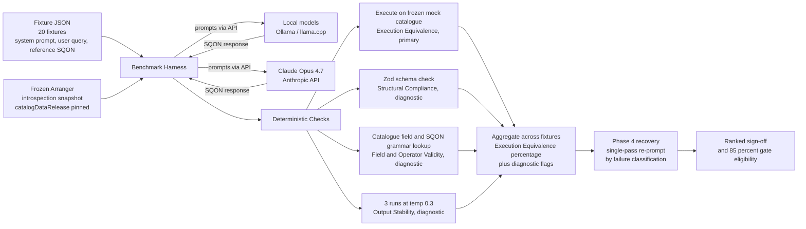

# Model Selection

Model selection has two goals: (A) identify the local model to be used in pilot testing, and (B) produce a ranked comparison of LLM candidates evaluated against our use case within our defined hardware envelope. The evaluation framework is adapted from Wada et al. (2026), scaled to fit our capacity and requirements.

## Use Case

The initial target capability is conversational data discovery: a researcher types a plain-language question such as "show me all breast cancer samples with RNA-seq data from Canadian donors" and the system translates it into a structured query executed against an Overture Arranger catalogue. Under the hood, this translation produces a valid SQON (Serializable Query Object Notation) filter, passed via an MCP server to an Elasticsearch index. SQON supports nested boolean logic (combinations of AND, OR, and NOT operations across catalogue fields), making correct, schema-aware generation non-trivial for a language model.

This evaluation is designed to be reproducible as we grow. Conversational discovery is the first capability, with downstream functionality including visualization and analysis of queried data to follow. A stable, citable baseline established here will carry forward as each new capability is added.

## Hardware Envelope

The hardware envelope defines the minimum specifications a user would need to run a candidate model locally. For model selection and evaluation, it establishes the environment each candidate is tested in and, by extension, sets a realistic ceiling on model capability, bounding eligibility based on parameter size and memory constraints.

For evaluation, models are grouped into four tiers defined by target hardware and corresponding memory requirements:

- The primary focus is the **_workstation tier_** (Apple M3/M4 Pro or Max, 16–24 GB unified memory), from which the pilot model will be selected.
- The \***\*edge tier\*\*** is held in reserve and activated only if workstation results suggest a smaller model floor is worth probing.
- The **_institutional tier_**, an HPC node with 80+ GB memory, serves as a fallback if workstation-class models prove insufficient, with one model evaluated initially and a broader set considered if needed.
- A **_frontier tier_** using a commercial API establishes the performance ceiling against which all other tiers are benchmarked, and is not a deployment target.

| Tier                 | Hardware               | Memory           | Role                                                                                                                          |
| -------------------- | ---------------------- | ---------------- | ----------------------------------------------------------------------------------------------------------------------------- |
| **_Edge (reserve)_** | CPU / NPU / ≤8 GB GPU  | ≤8 GB            | Mitigation, activated only if the workstation tier suggests a smaller floor is worth probing.                                 |
| **_Workstation_**    | Apple M3/M4 Pro or Max | 16–24 GB Unified | The main focus; the pilot model is selected from this tier.                                                                   |
| **_Institutional_**  | HPC (multi-GPU)        | ≥80 GB           | One model tested on an HPC node for initial comparison. A broader set considered if the workstation tier proves insufficient. |
| **_Frontier_**       | Commercial API         | N/A              | Defines the performance ceiling; not a deployment target.                                                                     |

## Model Candidates

Seven candidates spanning a variety of architectures, sizes, and tool-use specializations, plus one commercial frontier model used to define the current performance ceiling.

| Model                 | Tier          | Architecture | Params (Q4 VRAM)           | Key Advantage for SQON                                                                               |
| --------------------- | ------------- | ------------ | -------------------------- | ---------------------------------------------------------------------------------------------------- |
| **Phi-4-Reasoning**   | Workstation   | Dense        | 15B (~10 GB)               | High-density reasoning capability within the tightest VRAM constraints.                              |
| **Mistral Small 3.2** | Workstation   | Dense        | 24B (~15 GB)               | Native tool-use optimization reduces hallucinated field errors in SQON outputs.                      |
| **Qwen 3.5-27B**      | Workstation   | Dense        | 27B (~17 GB)               | Superior performance on multi-step complex logic and nested AND/OR structures.                       |
| **Gemma 4 31B**       | Workstation   | Dense        | 31B (~20 GB)               | High baseline stability; requires fewer correction iterations to reach accuracy gates.               |
| **Gemma 4 26B-A4B**   | Workstation   | MoE          | 26B / 3.8B active (~16 GB) | Provides 30B-class reasoning at significantly lower inference latency via active parameter sparsity. |
| **Llama 4 Scout**     | Institutional | MoE          | 109B / 17B active (~12 GB) | Handles massive catalogue schema contexts via dynamic expert loading and 16-expert MoE.              |
| **Claude Opus 4.7**   | Frontier      | Commercial   | N/A (managed API)          | Serves as the performance ceiling and gold standard for execution equivalence.                       |

<details>
<summary><strong>Sub-workstation candidates (≤8B parameters)</strong> held as a reserve list.</summary>

| Model               | Architecture | Params (Q4 VRAM) |
| ------------------- | ------------ | ---------------- |
| **Granite 4.1 8B**  | Dense        | 8B (~5.5 GB)     |
| **DeepSeek R1 8B**  | Distilled    | 8B (~5.2 GB)     |
| **Phi-4-Mini**      | Dense        | 3.8B (~2.8 GB)   |
| **Gemma 4 E4B**     | PLE Dense    | 4B (~3.1 GB)     |
| **Qwen 3 4B**       | Dense        | 4B (~2.9 GB)     |

</details>

<details>
<summary><strong>Larger institutional-tier candidates (&gt;70B parameters)</strong> held as a reserve list.</summary>

| Model                  | Architecture | Params (Active / Total)    |
| ---------------------- | ------------ | -------------------------- |
| **Llama 4 Maverick**   | MoE          | 17B active / 400B total    |
| **DeepSeek V3.5 / R1** | MoE          | 37B active / 671B total    |
| **Qwen 3 235B**        | MoE          | 22B active / 235B total    |
| **Mistral Large 3**    | Dense        | ~123B dense                |

</details>

## Fixtures

Each fixture consists of three components: a natural-language prompt, a reference SQON, and an expected record set. A single frozen Arranger introspection snapshot is shared across the fixture set, pinned to a commit of the development platform repository and referenced by hash from each fixture record.

The development platform hosts a sample of the Drug Discovery dataset across four catalogues: Correlation, Mutation, Expression, and Protein-Protein Interaction. All four are currently flat. At least one nested fixture target will be added to ensure nested-path resolution is tested.

Twenty fixtures are planned, mapped against common SQON operators:

| Bucket                              | Count | SQON operators exercised                                |
| ----------------------------------- | ----- | ------------------------------------------------------- |
| **Single-field filters**            | ~10   | in, gt/gte/lt/lte, between                              |
| **Multi-field boolean composition** | ~6    | and, or over heterogeneous field ops                    |
| **Negation / exclusion**            | ~3    | not, not-in, some-not-in                                |
| **Multi-step nested logic**         | ~1    | Deep and/or/not nesting, at least one nested-field path |

The following example illustrates a single-field fixture:

```json
{
  "id": "fixture-001",
  "bucket": "single_field",
  "catalog": "mutation",
  "introspection": {
    "commit": "3f76522",
    "repository": "overture-stack/prelude/tree/overtureMCP"
  },
  "user_query": "Find all mutations in tumor suppressor genes",
  "reference_sqon": {
    "op": "in",
    "content": {
      "fieldName": "data.is_tumor_suppressor_gene",
      "value": [true]
    }
  },
  "expected_record_count": 487,
  "expected_record_ids": ["mut_0001", "mut_0042", "..."],
  "notes": "Binary keyword lookup against the Mutation catalogue. A model that selects a semantically adjacent field (e.g. data.is_oncogene) instead of the correct one is the failure mode this fixture is designed to surface."
}
```

## Scoring and Screening

The primary performance metric is execution equivalence: the percentage of fixtures where the generated SQON returns the correct record set against the frozen index, computed as an exact record-set match. This is reported per model as a percentage across the 20-fixture set, and is the basis for both ranking and the pilot eligibility gate.

| Metric                                                | Implementation                                                                                                                                                                                                                                                                                                                        |
| ----------------------------------------------------- | ------------------------------------------------------------------------------------------------------------------------------------------------------------------------------------------------------------------------------------------------------------------------------------------------------------------------------------- |
| **Execution Equivalence** (Key performance indicator) | Generated SQON returns the correct record set against the frozen index, computed as an exact record-set match. Reported as a percentage across the 20-fixture set.                                                                                                                                                                    |
| **Structural Compliance** (Diagnostic measure)        | Final-attempt SQON passes the `@overture-stack/sqon` Zod schema. Reported as a percentage of fixtures producing a parseable SQON. Distinguishes models that generate invalid structure from those that produce valid but semantically incorrect queries.                                                                              |
| **Field & Operator Validity** (Diagnostic measure)    | All fieldNames checked against the Arranger fields endpoint, and all operators checked against the SQON grammar for applicability to the field type. Reported as a percentage of valid field-operator combinations. Useful for identifying whether execution failures stem from schema misunderstanding rather than reasoning errors. |
| **Output Stability** (Diagnostic measure)             | Record-set consistency across three identical runs at temperature 0.3 per fixture. Reported as the percentage of fixtures where all three runs return equivalent record sets. Flags models whose outputs are unreliable at modest sampling temperatures.                                                                              |

Screening runs in four phases, with models eliminated by progressively harder tests.

| Phase                                    | What happens                                                                                                                                                                                                                                     | What it tells us                                                                                                                                                                                                       |
| ---------------------------------------- | ------------------------------------------------------------------------------------------------------------------------------------------------------------------------------------------------------------------------------------------------ | ---------------------------------------------------------------------------------------------------------------------------------------------------------------------------------------------------------------------- |
| **1. Baseline Screening**                | All candidates run zero-shot against the full 20-fixture set, with the frozen Arranger introspection snapshot injected as context. No live API calls.                                                                                            | Establishes a raw execution-equivalence baseline across all candidates.                                                                                                                                                |
| **2. Capacity-Matched Prompting**        | Models scoring above the first quartile are re-run with chain-of-thought and few-shot prompting. Models below it are re-run with simplified, format-focused prompts.                                                                             | Identifies which models have the reasoning depth for multi-step SQON logic, and whether simpler prompts close the format-compliance gap for weaker models.                                                             |
| **3. Execution Equivalence and Latency** | Each candidate is run on its target tier. Execution equivalence is measured against the frontier baseline alongside latency per query. Models with median latency above 10 seconds are flagged but not excluded.                                 | Produces the per-candidate execution-equivalence score used for ranking. Failures are carried forward to Phase 4.                                                                                                      |
| **4. Failure Recovery**                  | Phase 3 failures are re-prompted with feedback: the model is told the failure classification (structural, semantic-field, semantic-value, or semantic-scope) and given one attempt to correct its output without being shown the reference SQON. | Determines whether failures are recoverable from minimal feedback alone, and identifies which failure types respond to correction re-prompting. Structural failures typically recover more readily than semantic ones. |

The 85% execution-equivalence gate is applied after Phase 4. A model that fails to clear the gate on the workstation tier is not eligible for the pilot but remains in the full ranked comparison. Correction re-prompting is limited to one pass in this evaluation; iterative optimization is deferred to a later phase.

## Dataflow



## End-End Example

:::info
All examples in this section are **hypothetical and illustrative**. No model evaluation has been run yet. The numbers, outputs, and outcomes are constructed to demonstrate the expected form of results for each phase. They are not real benchmark data.
:::

These worked examples cover each of the four screening phases. Each example uses fixtures derived from real Arranger introspection of the mutation catalogue. Scoring is **deterministic throughout**: execution equivalence against pre-authored reference SQON, supplemented by three diagnostic checks (structural, field-and-operator, stability). No LLM-as-judge appears in the scoring loop.

<details>
<summary><strong>Phase 1: Baseline Screening (Zero-Shot)</strong></summary>

Phase 1 establishes a raw execution-equivalence baseline for all seven candidates without any prompt engineering. Models scoring above the first-quartile threshold receive Chain-of-Thought prompts in Phase 2; models below receive simplified format-focused prompts (the Wada-derived capacity-matched split).

:::note
**Prompts and queries are delivered by a benchmark harness, not pasted into a chat UI.** The system-prompt and user-query blocks shown in the examples below are the _content_ of each fixture (stored in the fixture YAML). At run time, a harness iterates over fixtures × candidate models, posts each `{system_prompt, user_query}` pair to the model's inference endpoint (Ollama / llama.cpp server for local models, Anthropic API for Claude Opus 4.7), captures the raw response, and pipes it through the deterministic checks. Hand-pasting into a chat interface would make Output Stability unmeasurable (three identical runs cannot be reproduced manually) and would block reproducibility across the ~420 calls a full sweep requires (7 models × ~20 fixtures × 3 stability runs).
:::

#### Example 1.1: Mutation Catalogue, Simple Single-Field Query

**System prompt** (dynamically constructed from `/introspection/mutation`):

```
You are a data discovery assistant. Your task is to convert the user's natural
language query into a valid SQON filter for the Arranger search API.

Catalog: mutation
Available fields and valid operators:
  data.hugo_symbol                  (keyword) operators: in, not-in, some-not-in, all, filter
  data.cancer_type                  (keyword) operators: in, not-in, some-not-in, all, filter
  data.is_oncogene                  (keyword) operators: in, not-in, some-not-in, all, filter
  data.is_tumor_suppressor_gene     (keyword) operators: in, not-in, some-not-in, all, filter
  data.overall_mutation_frequency   (keyword) operators: in, not-in, some-not-in, all, filter
  data.dataset_name                 (keyword) operators: in, not-in, some-not-in, all, filter

SQON structure:
  Combination operator: { "op": "and" | "or" | "not", "content": [ <sqon>, ... ] }
  Field filter: { "op": "in" | "not-in" | ..., "content": { "fieldName": "...", "value": [...] } }

Output only valid JSON. No explanation. No markdown formatting.
```

**User query:** `"Find all mutations in tumor suppressor genes"`

**Reference SQON:**

```json
{
  "op": "in",
  "content": {
    "fieldName": "data.is_tumor_suppressor_gene",
    "value": ["true"]
  }
}
```

##### Example 1.1a: Qwen 3.5-27B (Q4_K_M), Pass

```json
{
  "op": "in",
  "content": {
    "fieldName": "data.is_tumor_suppressor_gene",
    "value": ["true"]
  }
}
```

**Deterministic checks:**

| Metric                      | Result | Notes                                                                   |
| --------------------------- | ------ | ----------------------------------------------------------------------- |
| Execution Equivalence       | Pass   | 487 records, exact record-set match to reference                        |
| Structural Compliance       | Pass   | Valid SQON per `@overture-stack/sqon` Zod schema                        |
| Field and Operator Validity | Pass   | `data.is_tumor_suppressor_gene` exists; `in` valid for keyword type     |
| Output Stability            | Pass   | All 3 runs at `temperature=0.3` return execution-equivalent record sets |

Fixture passes execution equivalence; all diagnostics clean. Contributes a pass toward this candidate's aggregate equivalence percentage. Whether the candidate as a whole advances in the high-performing group is decided once the full 20-fixture sweep is complete and the Q1 threshold is computed.

##### Example 1.1b: Llama 4 Scout (FP8 on A100), Field Validity Failure

```json
{
  "op": "in",
  "content": {
    "fieldName": "tumor_suppressor",
    "value": "true"
  }
}
```

**Deterministic checks:**

| Metric                      | Result | Notes                                                                                                                                  |
| --------------------------- | ------ | -------------------------------------------------------------------------------------------------------------------------------------- |
| Execution Equivalence       | Fail   | Query fails schema validation; 0 records returned, no record-set match                                                                 |
| Structural Compliance       | Fail   | `value` is a bare string, not an array, so the Zod schema check fails                                                                  |
| Field and Operator Validity | Fail   | `tumor_suppressor` does not exist; correct field is `data.is_tumor_suppressor_gene`. `in` would be valid for keyword type in isolation |
| Output Stability            | Pass   | Consistent (empty) record set across 3 runs at `temperature=0.3`                                                                       |

Fixture fails execution equivalence and does not count toward the aggregate equivalence percentage. The diagnostic flags show the failure is jointly structural and semantic-field, which is the classification that will be carried forward if the candidate reaches Phase 4.

:::note
Every cell in the table is decidable without a judge: structural validity is a Zod check, field existence is a catalogue lookup, operator validity is a grammar check, execution equivalence is a record-set diff. Execution Equivalence determines whether the fixture counts as a pass; the diagnostics explain why a failure occurred and feed forward into Phase 4 classification.
:::

</details>

<details>
<summary><strong>Phase 2: Capacity-Matched Prompting</strong></summary>

Phase 2 splits the shortlist into two groups based on Phase 1 scores and applies prompts matched to capacity. The high-performing group receives Chain-of-Thought prompts with multi-step examples. The lower-performing group receives simplified format-focused prompts. Wada et al.'s key finding is that simplified prompts can unlock format compliance in lower-capacity models even when reasoning depth remains insufficient.

#### Example 2.1: High-Performing Group, Multi-Condition CoT Prompt

The CoT prompt adds explicit step-by-step reasoning instructions and two worked examples before the user query, then asks for SQON only.

**System prompt addition** (excerpt):

```
IMPORTANT: Before generating SQON, think through the query step by step:
1. Identify all conditions the user is asking for
2. Determine the logical operators (AND/OR) between conditions
3. Map each condition to a field in the available schema
4. Construct the SQON structure, combining conditions as needed

Few-Shot Example:
User: "Find mutations in TP53 from lung or breast cancer"
Thought: User wants (TP53 gene) AND (lung OR breast cancer). Top-level op is AND
because the user wants records matching both a specific gene AND one of the two
cancer types.
SQON: { "op": "and", "content": [ ... ] }
```

**User query:** `"Find mutations in BRCA1, BRCA2, or TP53 from breast or ovarian cancer that are tumor suppressors"`

**Reference SQON:**

```json
{
  "op": "and",
  "content": [
    {
      "op": "in",
      "content": {
        "fieldName": "data.hugo_symbol",
        "value": ["BRCA1", "BRCA2", "TP53"]
      }
    },
    {
      "op": "in",
      "content": {
        "fieldName": "data.cancer_type",
        "value": ["Breast Adenocarcinoma", "Ovarian Adenocarcinoma"]
      }
    },
    {
      "op": "in",
      "content": {
        "fieldName": "data.is_tumor_suppressor_gene",
        "value": ["true"]
      }
    }
  ]
}
```

**Qwen 3.5-27B output under CoT prompt** is identical to the reference. Execution Equivalence passes at 212 records; all three diagnostics pass. Output Stability holds across the three runs at `temperature=0.3`: array order varies between runs, but the executed record sets are identical, which is the basis of the stability check.

#### Example 2.2: Lower-Performing Group, Simplified Format Prompt

Same query, simpler prompt that omits CoT and emphasises format compliance:

```
Convert natural language to SQON JSON.

Catalog: mutation
Fields: data.hugo_symbol, data.cancer_type, data.is_oncogene,
data.is_tumor_suppressor_gene, data.overall_mutation_frequency, data.dataset_name

SQON format:
Field filter: { "op": "in", "content": { "fieldName": "DATA.FIELD", "value": [...] } }
Combination: { "op": "and", "content": [ ... ] }

Output JSON only. No explanation.
```

**Llama 4 Scout output under simplified prompt:**

```json
{
  "op": "and",
  "content": [
    {
      "op": "in",
      "content": {
        "fieldName": "data.hugo_symbol",
        "value": ["BRCA1", "BRCA2", "TP53"]
      }
    },
    {
      "op": "in",
      "content": {
        "fieldName": "data.cancer_type",
        "value": ["Breast Adenocarcinoma", "Ovarian Adenocarcinoma"]
      }
    }
  ]
}
```

The model misses the tumor-suppressor condition. Diagnostics: Structural Compliance pass, Field and Operator Validity pass, Output Stability pass. Execution Equivalence fails: the returned set is a strict superset of the reference, so the record-set diff is non-empty.

This is the Wada-derived finding: simplified prompts close the _format-compliance gap_ (all three diagnostics now pass) but not the _reasoning gap_ (execution equivalence remains a miss on multi-condition queries). It is a publishable methodological observation for the grant; it confirms the lower-tier model is unsuitable for the pilot even with prompt-engineering help.

</details>

<details>
<summary><strong>Phase 3: Execution Equivalence & Latency</strong></summary>

Phase 3 runs each candidate on its assigned hardware tier across the 20-fixture set and measures execution equivalence against the frontier baseline (Claude Opus 4.7) plus median latency per query. The ≥85% execution-equivalence gate is the Aim 1 hard threshold for pilot eligibility, applied after Phase 4.

#### Execution Equivalence Results

| Model                          | Tier               | Fixtures Matched | Execution Equivalence | Latency (median) | Pilot Eligible        |
| ------------------------------ | ------------------ | ---------------- | --------------------- | ---------------- | --------------------- |
| **Claude Opus 4.7**            | Managed API        | 20/20            | 100% (baseline)       | 1.1 s            | Ceiling               |
| **Mistral Small 3.2 (Q4_K_M)** | Workstation 16 GB  | 18/20            | 90.0%                 | 2.4 s            | Yes                   |
| **Qwen 3.5-27B (Q4_K_M)**      | Workstation 24 GB  | 18/20            | 90.0%                 | 3.2 s            | Yes                   |
| **Gemma 4 31B (Q4_K_M)**       | Workstation 24 GB  | 17/20            | 85.0%                 | 4.8 s            | Yes                   |
| **Gemma 4 26B-A4B (Q4_K_M)**   | Workstation 24 GB  | 16/20            | 80.0%                 | 2.1 s            | No                    |
| **Phi-4-Reasoning (Q4_K_M)**   | Workstation 16 GB  | 15/20            | 75.0%                 | 1.8 s            | No                    |
| **Llama 4 Scout (FP8)**        | Institutional A100 | 17/20            | 85.0%                 | 0.6 s            | Resource profile only |

In this worked example, **three local models clear the ≥85% gate at zero-shot baseline** (Qwen 3.5-27B and Mistral Small 3.2 at 18/20, Gemma 4 31B at 17/20). The remaining two workstation candidates fall below the gate at zero-shot and proceed to Phase 4 to see whether failures are recoverable from minimal feedback. The tool-use-specialised candidate (Mistral Small 3.2) ties Qwen at zero-shot despite being smaller, supporting the hypothesis that workload-aligned specialization matters at this scale.

#### Example 3.1: Record-Set Drift Failure

Llama 4 Scout's failure on the query `"Find all mutations in TP53"` returns 489 records when the reference returns 487:

```json
{
  "op": "in",
  "content": { "fieldName": "data.hugo_symbol", "value": ["TP53", "tp53"] }
}
```

The model expanded the value array with a case-variant. Diagnostics are clean: Structural Compliance pass, Field and Operator Validity pass, Output Stability pass. Execution Equivalence fails because the record set differs from the reference (489 vs 487). This is exactly the kind of error a structure-only check would miss but execution equivalence catches.

</details>

<details>
<summary><strong>Phase 4: Failure Recovery</strong></summary>

In Phase 4, each Phase 3 failure is classified by failure type and the model is re-prompted **once** with the classification label alone, without being shown the reference SQON. The four classes are **structural** (invalid SQON), **semantic-field** (valid field, wrong one for the query), **semantic-value** (correct field, wrong threshold or value), and **semantic-scope** (correct field and value, wrong operator combination). The post-Phase 4 equivalence is the number compared against the ≥85% gate; the recovery profile (which failure types recover after one pass) is reported alongside. Full iterative recovery with measured convergence trajectories is deferred to Aim 2.

#### Example 4.1: Single-Pass Recovery on a Semantic-Scope Failure

Original query: `"Find oncogenes in breast cancer that are also in the expression dataset"`

**Initial Qwen 3.5-27B output** (wrong top-level operator):

```json
{
  "op": "or",
  "content": [
    {
      "op": "in",
      "content": { "fieldName": "data.is_oncogene", "value": ["true"] }
    },
    {
      "op": "in",
      "content": {
        "fieldName": "data.cancer_type",
        "value": ["Breast Adenocarcinoma"]
      }
    },
    {
      "op": "in",
      "content": { "fieldName": "data.dataset_name", "value": ["expression"] }
    }
  ]
}
```

Execution returns 2,847 records; reference returns 156. Execution equivalence fails. Diagnostics are clean (Structural Compliance, Field and Operator Validity, and Output Stability all pass), so the failure is classified as **semantic-scope**.

**Phase 4 re-prompt** (classification label only, reference SQON withheld):

```
Your previous SQON was classified as a semantic-scope failure: the structure and
the field/operator choices are individually valid, but the operator combination
does not match the user's intent. Reconsider how the conditions should be
combined and output the corrected SQON only.
```

**Corrected output** matches the reference; execution equivalence passes at 156 records.

#### Phase 4 Recovery Summary (Worked Example)

| Model                          | Phase 3 Equiv. | Failure Type       | Recovered After 1 Pass | Phase 4 Equiv. | Pilot Eligible        |
| ------------------------------ | -------------- | ------------------ | ---------------------- | -------------- | --------------------- |
| **Qwen 3.5-27B (Q4_K_M)**      | 90.0%          | Semantic-scope (2) | 2/2 recovered          | 100%           | Yes                   |
| **Mistral Small 3.2 (Q4_K_M)** | 90.0%          | Semantic-scope (2) | 2/2 recovered          | 100%           | Yes                   |
| **Gemma 4 31B (Q4_K_M)**       | 85.0%          | Mixed (3)          | 1/3 recovered          | 90.0%          | Yes                   |
| **Gemma 4 26B-A4B (Q4_K_M)**   | 80.0%          | Semantic-field (4) | 1/4 recovered          | 85.0%          | Yes                   |
| **Phi-4-Reasoning (Q4_K_M)**   | 75.0%          | Structural (5)     | 1/5 recovered          | 80.0%          | No (below gate)       |
| **Llama 4 Scout (FP8)**        | 85.0%          | Semantic-field (3) | 0/3 recovered          | 85.0%          | Resource profile only |

In this worked example, three local models are pilot-eligible after Phase 4: Qwen 3.5-27B and Mistral Small 3.2 (both already clear at zero-shot, reaching 100% post-recovery) and Gemma 4 31B (recovers from 85.0% to 90.0%, just clearing the gate). The recovery profile shows that semantic-scope failures (wrong operator combination) respond well to classification-only feedback, while semantic-field failures (wrong field entirely) do not. This is consistent with the prior that scope errors reflect a mis-selected combinator over an otherwise-correct field set, whereas field errors require information the classification label alone cannot supply.

:::note
Aim 1 caps recovery at a single pass because iterative convergence measurement requires multi-pass tracking and reviewer effort the team does not have. Aim 2 promotes Phase 4 to a measured iterative loop with convergence trajectories.
:::

</details>

<details>
<summary><strong>Mock Sign-Off Outcome</strong> illustrative end-state of the four phases above, showing the form a real sign-off will take.</summary>

The final deliverable of model selection is a sign-off summary: pilot model, full ranked comparison across all 7 candidates, gate eligibility, and any methodological findings worth surfacing to the grant. These outcomes are the inputs to [Regression Testing](./05-Regression-Testing) (which inherits the pilot model and fixture set) and [User Testing](./06-User-Testing) (which deploys the pilot model against real researchers). See the **Mock Sign-Off Outcome** dropdown at the end of Worked Examples for the form this report takes.

The four-phase screening on this worked example produces:

- **Pilot model:** Qwen 3.5-27B (Workstation tier, Q4_K_M): 100% execution equivalence after single-pass Phase 4 recovery; selected over Mistral on margin of demonstrated correctness on multi-step queries.
- **Full ranked sign-off comparison (all 7 candidates):**

| Rank | Model             | Tier          | Phase 3 Equivalence | Phase 4 Equivalence | Latency (median) | Pilot Eligible        |
| ---- | ----------------- | ------------- | ------------------- | ------------------- | ---------------- | --------------------- |
| N/A  | Claude Opus 4.7   | Commercial    | 100% (baseline)     | N/A                 | 1.1 s            | Ceiling               |
| 1    | Qwen 3.5-27B      | Workstation   | 90.0%               | 100%                | 3.2 s            | Yes                   |
| 2    | Mistral Small 3.2 | Workstation   | 90.0%               | 100%                | 2.4 s            | Yes                   |
| 3    | Gemma 4 31B       | Workstation   | 85.0%               | 90.0%               | 4.8 s            | Yes                   |
| 4    | Gemma 4 26B-A4B   | Workstation   | 80.0%               | 85.0%               | 2.1 s            | Yes                   |
| 5    | Phi-4-Reasoning   | Workstation   | 75.0%               | 80.0%               | 1.8 s            | No (below gate)       |
| N/A  | Llama 4 Scout     | Institutional | 85.0%               | 85.0%               | 0.6 s            | Resource profile only |

- **Institutional data point:** Llama 4 Scout on rented A100 (85.0%, 0.6 s/query), preserved for the resource profile but not pilot-eligible.
- **Wada-style finding:** Capacity-matched prompting closed the format-compliance gap for the lower group but did not close the reasoning gap; single-pass Phase 4 recovery recovered the high-group failures. Reported as a methodological observation in the baseline document.
- **Workload-alignment finding:** Mistral Small 3.2 (tool-use-specialised, 24B) matched Qwen 3.5-27B (general reasoning, 27B) at zero-shot and after Phase 4 recovery, despite being smaller. Suggests workload-aligned specialization is at least as valuable as raw parameter count at this scale. This finding is what motivates including Mistral in the shortlist; without it the dataset cannot support the claim.

</details>

## References

Wada, A., et al. (2026). "Bridging the performance gap: systematic optimization of local LLMs for Japanese medical PHI extraction." _Scientific Reports_ / PMC. https://pmc.ncbi.nlm.nih.gov/articles/PMC12894992/
